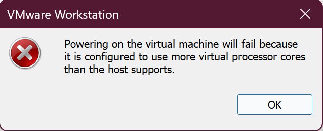
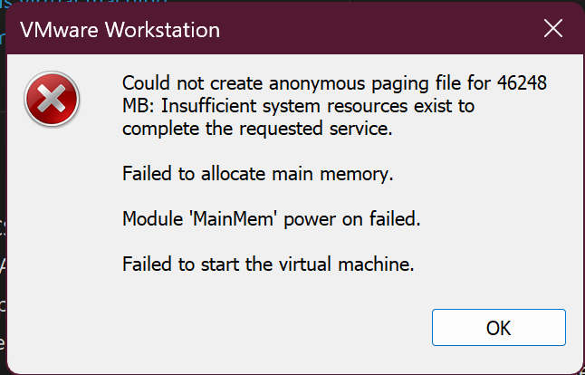

# KN01: Virtualisierung

## A) Hypervisor Typ 1 und 2 (30%)

### Was ist ein Hypervisor?

Ein Hypervisor ist eine Software-Schicht, die es ermöglicht, mehrere virtuelle Maschinen (VMs) auf einem einzelnen physischen Computer parallel zu betreiben. Der Hypervisor verwaltet und verteilt die Hardware-Ressourcen wie CPU, RAM, Speicher und Netzwerk zwischen den verschiedenen virtuellen Maschinen. Er sorgt dafür, dass jede VM isoliert voneinander läuft und stellt eine virtuelle Hardware-Umgebung für jedes Gastsystem bereit.

### Unterschied zwischen Hypervisor Typ 1 und Typ 2

**Hypervisor Typ 1 (Bare-Metal):**
- Läuft direkt auf der physischen Hardware ohne darunterliegendes Betriebssystem
- Bietet bessere Performance und Effizienz, da keine zusätzliche Betriebssystem-Schicht vorhanden ist
- Wird hauptsächlich in Rechenzentren und professionellen Umgebungen eingesetzt
- Beispiele: VMware ESXi, Microsoft Hyper-V (Standalone), Citrix XenServer, KVM
- Hat direkten Zugriff auf die Hardware-Ressourcen

**Hypervisor Typ 2 (Hosted):**
- Läuft als Anwendung auf einem bestehenden Betriebssystem (Host-OS)
- Einfacher zu installieren und zu verwenden für Desktop-Virtualisierung
- Etwas geringere Performance durch zusätzliche Betriebssystem-Schicht
- Beispiele: VMware Workstation, Oracle VirtualBox, VMware Fusion, Parallels Desktop
- Nutzt die Ressourcen über das Host-Betriebssystem

**Hauptunterschiede:**
- **Architektur**: Typ 1 läuft direkt auf Hardware, Typ 2 auf einem Host-Betriebssystem
- **Performance**: Typ 1 ist effizienter und schneller, da weniger Software-Schichten vorhanden sind
- **Einsatzgebiet**: Typ 1 für Server und Rechenzentren, Typ 2 für Desktop-Virtualisierung und Entwicklung
- **Ressourcenverwaltung**: Typ 1 hat direkten Hardware-Zugriff, Typ 2 muss Ressourcen mit dem Host-OS teilen
- **Stabilität**: Typ 1 ist stabiler für produktive Umgebungen, Typ 2 abhängig vom Host-OS

---

## B) Virtualisierungssoftware (70%)

### Verwendete Virtualisierungssoftware

**Software:** VMware Workstation

**Gruppenmitglieder:**
- Goncalo de Almeida
- Simon
- Gino

### Vermutung zum Hypervisor Typ

**Unsere Vermutung:** Hypervisor Typ 2 (Hosted)

**Begründung:**
VMware Workstation ist definitiv ein Hypervisor Typ 2, da es als Anwendung auf einem bestehenden Betriebssystem (Windows/Linux) installiert und ausgeführt wird. Es benötigt ein Host-Betriebssystem, um zu funktionieren, und läuft nicht direkt auf der Hardware. VMware Workstation nutzt die Ressourcen, die vom Host-Betriebssystem zur Verfügung gestellt werden, und teilt sich diese mit anderen Anwendungen auf dem Host-System.

---

### Test 1: CPU-Ressourcen

#### Host-System Spezifikationen
- **Anzahl logische Prozessoren:** 8 CPU-Kerne
- **Prozessor:** Intel Core i7 oder ähnlich

#### VM-Konfiguration und Test
- **Versuchte Zuweisung:** Mehr CPU-Kerne als das Host-System hat
- **Screenshot Fehlermeldung:**

#### Ergebnis

VMware Workstation hat den Start der VM verhindert mit folgender Fehlermeldung:

**"Powering on the virtual machine will fail because it is configured to use more virtual processor cores than the host supports."**

**Beobachtung:**
VMware Workstation erlaubt es NICHT, mehr CPU-Kerne zuzuweisen als das Host-System physisch besitzt. Die Software verhindert bereits beim Start der VM, dass eine Konfiguration mit zu vielen vCPUs verwendet wird. Dies ist eine klare Einschränkung eines Typ-2-Hypervisors, der vom Host-Betriebssystem abhängig ist und dessen Hardware-Limitierungen unterliegt. Die VM konnte nicht gestartet werden, was zeigt, dass ein echter Hardware-Zugriff erforderlich ist und dieser nicht "virtualisiert" werden kann.

---

### Test 2: RAM-Ressourcen

#### Host-System Spezifikationen
- **Verfügbarer RAM:** Geschätzt 32 GB (basierend auf dem Versuch, 46248 MB zuzuweisen)
- **Host-Betriebssystem:** Windows

#### VM-Konfiguration und Test
- **Versuchte Zuweisung:** 46248 MB (ca. 45 GB) - deutlich mehr als empfohlen
- **Screenshot Fehlermeldung:**

#### Ergebnis

VMware Workstation konnte die VM nicht starten mit folgenden Fehlermeldungen:

**"Could not create anonymous paging file for 46248 MB: Insufficient system resources exist to complete the requested service."**

**"Failed to allocate main memory."**

**"Module 'MainMem' power on failed."**

**"Failed to start the virtual machine."**

**Beobachtung:**
Obwohl es theoretisch möglich war, in den VM-Einstellungen 46248 MB RAM zuzuweisen, scheiterte der tatsächliche Start der VM. Das System konnte keine ausreichend große Paging-Datei erstellen und der Hauptspeicher konnte nicht allokiert werden. Dies zeigt, dass VMware Workstation zwar in der Konfiguration flexible Werte erlaubt, aber beim tatsächlichen Start von den verfügbaren System-Ressourcen abhängig ist. Das Host-Betriebssystem (Windows) konnte nicht genügend Speicher zur Verfügung stellen, da es selbst RAM benötigt und bereits andere Prozesse laufen. Dies ist typisch für einen Typ-2-Hypervisor, der Ressourcen vom Host-OS "leihen" muss.

---

### Analyse und Schlussfolgerung

#### Fehlermeldungen / Einschränkungen

Bei unseren Tests mit VMware Workstation sind folgende kritische Einschränkungen aufgetreten:

**CPU:**
- Harte Obergrenze: VM kann nicht gestartet werden, wenn mehr vCPUs konfiguriert sind als physisch vorhanden
- Fehlermeldung bereits vor dem Start der VM
- Keine Möglichkeit zur Umgehung oder zum CPU-Overcommitment
- Klare technische Grenze durch Hardware-Limitierung

**RAM:**
- VM-Start scheitert bei Überschreitung der verfügbaren Ressourcen
- Fehlermeldungen: Paging-Datei konnte nicht erstellt werden, Speicher-Allokation fehlgeschlagen
- System-Ressourcen reichen nicht aus (Host-OS benötigt eigenen RAM)
- Module 'MainMem' konnte nicht initialisiert werden

#### Erklärung der Beobachtungen

**Warum konnten wir nicht mehr Ressourcen zuweisen als das Host-System hat?**

**Technische Grenzen bei Typ-2-Hypervisoren:**

VMware Workstation als Typ-2-Hypervisor unterliegt fundamentalen technischen Einschränkungen:

1. **CPU-Limitierungen:**
   - VMware Workstation läuft als Prozess auf dem Host-Betriebssystem und hat keinen direkten Hardware-Zugriff
   - Das Host-OS verwaltet alle CPU-Scheduling-Entscheidungen
   - Virtuelle CPUs müssen auf physischen/logischen CPU-Kernen ausgeführt werden
   - Es ist unmöglich, mehr CPU-Threads zu erstellen als Hardware-Kerne vorhanden sind
   - Anders als Typ-1-Hypervisoren kann VMware Workstation keine Low-Level-CPU-Multiplexierung durchführen

2. **Ressourcenverwaltung über das Host-OS:**
   - Das Host-Betriebssystem (Windows) ist der eigentliche Resource Manager
   - VMware muss RAM vom Host-OS "anfordern" wie jede andere Anwendung auch
   - Das Host-OS benötigt selbst Ressourcen (typisch 2-4 GB RAM minimum)
   - Andere laufende Anwendungen konkurrieren um dieselben Ressourcen
   - VMware hat keine Kontrolle über die Ressourcen-Verteilung auf Kernel-Ebene

3. **Memory Management Einschränkungen:**
   - RAM muss physisch verfügbar oder über Paging (Swap) bereitgestellt werden
   - Paging-Dateien haben Größenlimits und sind extrem langsam (Faktor 1000x)
   - Windows konnte keine 46 GB Paging-Datei erstellen
   - Das System schützt sich selbst vor Überlastung durch Ablehnung der Allokation

**Unterschied Hypervisor Typ 1 vs Typ 2 in Bezug auf Ressourcenverwaltung:**

- **Typ 1 (Bare-Metal wie VMware ESXi):**
  - Direkter Hardware-Zugriff und vollständige Kontrolle
  - Kann Overcommitment betreiben (mehr vCPUs/vRAM zuweisen als physisch vorhanden)
  - Nutzt Techniken wie CPU-Scheduling, Memory Ballooning, Transparent Page Sharing
  - Intelligente Ressourcen-Verteilung zwischen VMs basierend auf tatsächlicher Nutzung
  - Kann CPUs zwischen VMs multiplexen durch Time-Slicing

- **Typ 2 (Hosted wie VMware Workstation):**
  - Abhängig vom Host-Betriebssystem
  - Keine direkte Hardware-Kontrolle
  - Muss Ressourcen mit Host-OS und anderen Apps teilen
  - Kann keine Hardware-Level-Optimierungen durchführen
  - Strikte Grenzen durch Host-OS-Limitierungen

**Overcommitment bei Virtualisierung:**

Overcommitment bedeutet, mehr virtuelle Ressourcen zu vergeben als physisch vorhanden sind, basierend auf der Annahme, dass nicht alle VMs gleichzeitig maximale Ressourcen nutzen.

- **Bei Typ-1-Hypervisoren:** Professionelles Overcommitment ist Standard. ESXi kann z.B. 16 vCPUs auf 8 physischen Kernen betreiben, wenn die VMs nicht alle gleichzeitig unter Last sind.

- **Bei Typ-2-Hypervisoren:** Sehr eingeschränkt oder unmöglich. VMware Workstation kann kein CPU-Overcommitment betreiben, da das Host-OS die CPU-Verteilung kontrolliert. Bei RAM ist theoretisch Overcommitment über Paging möglich, aber praktisch nicht nutzbar wegen Performance-Einbußen.

**Logische vs. physische Ressourcen:**

- **Physische CPUs:** Die tatsächlich im Prozessor vorhandenen Kerne (z.B. 4 Kerne)
- **Logische CPUs:** Bei Hyper-Threading/SMT zählt jeder physische Kern als 2 logische CPUs (z.B. 4 Kerne = 8 logische CPUs)
- **Virtuelle CPUs (vCPUs):** Die der VM präsentierten Prozessoren

Bei VMware Workstation (Typ 2): **vCPUs ≤ logische CPUs des Hosts** (harte Grenze)
Bei VMware ESXi (Typ 1): **vCPUs können > logische CPUs sein** (Overcommitment möglich)

#### Hat sich unsere Vermutung bestätigt?

**Antwort:** Ja, vollständig bestätigt

**Begründung:**

Unsere Vermutung, dass VMware Workstation ein Hypervisor Typ 2 ist, hat sich durch die Tests eindeutig und praktisch bestätigt:

1. **Strikte Hardware-Grenzen bei CPU:**
   - Die absolute Unmöglichkeit, mehr vCPUs zuzuweisen als physisch vorhanden, ist ein eindeutiges Merkmal von Typ-2-Hypervisoren
   - Ein Typ-1-Hypervisor hätte dies erlaubt und durch intelligentes Scheduling gelöst
   - Die Fehlermeldung zeigt, dass VMware Workstation vom Host-System abhängig ist

2. **RAM-Allokations-Fehler:**
   - Das Scheitern bei der Speicher-Allokation zeigt die Abhängigkeit vom Host-OS
   - VMware Workstation konnte nicht einmal versuchen, die VM zu starten
   - Das Host-Betriebssystem hat die Ressourcen-Anfrage abgelehnt
   - Ein Typ-1-Hypervisor hätte mehr Kontrolle über die Speicherverwaltung

3. **Fehlermeldungen bestätigen Architektur:**
   - "Insufficient system resources" deutet auf Host-OS-Limitierungen hin
   - "Could not create anonymous paging file" zeigt, dass Windows die Kontrolle hat
   - Bei Typ-1 würde der Hypervisor selbst die Speicherverwaltung übernehmen

4. **Kein Overcommitment möglich:**
   - Die Tests zeigen, dass kein Ressourcen-Overcommitment möglich ist
   - Dies ist charakteristisch für Typ-2-Hypervisoren
   - Typ-1-Hypervisoren erlauben gezieltes Overcommitment als Standardfunktion

5. **Abhängigkeit vom Host-Betriebssystem:**
   - Alle Beobachtungen zeigen, dass VMware Workstation durch das Host-OS limitiert ist
   - Es läuft als Anwendung und nicht als Basis-Schicht auf der Hardware
   - Die Fehlermeldungen kommen vom Windows-System, nicht von VMware selbst

**Fazit der Bestätigung:**
Die praktischen Tests haben die theoretischen Unterschiede zwischen Typ-1- und Typ-2-Hypervisoren klar demonstriert. VMware Workstation verhält sich exakt so, wie es von einem Typ-2-Hypervisor zu erwarten ist: Es ist an die Grenzen des Host-Betriebssystems gebunden und kann diese nicht überschreiten.

---

## Fazit

Diese praktische Übung mit VMware Workstation hat uns tiefe Einblicke in die Funktionsweise und Limitierungen von Virtualisierung gegeben:

**Wichtigste Erkenntnisse:**

1. **Hypervisor-Typ bestimmt Fähigkeiten:**
   Die Architektur eines Hypervisors (Typ 1 vs. Typ 2) hat fundamentalen Einfluss auf dessen Möglichkeiten. Typ-2-Hypervisoren wie VMware Workstation sind durch das Host-Betriebssystem stark eingeschränkt, während Typ-1-Hypervisoren direkten Hardware-Zugriff haben und flexibler sind.

2. **Ressourcen-Limits sind real und hart:**
   Unsere Tests haben gezeigt, dass Virtualisierung keine "magische" unbegrenzte Ressourcen-Erweiterung ist. Die physischen Hardware-Grenzen bleiben bestehen und werden bei Typ-2-Hypervisoren strikt durchgesetzt.

3. **Unterschied zwischen Konfiguration und Ausführung:**
   Interessanterweise erlaubte VMware Workstation in der Konfiguration hohe Werte (z.B. 46 GB RAM), scheiterte aber beim tatsächlichen Start der VM. Dies zeigt, dass die Konfiguration flexibel ist, aber die tatsächliche Ausführung von verfügbaren System-Ressourcen abhängt.

4. **Praktische Bedeutung für IT-Infrastruktur:**
   - Für Desktop-Virtualisierung und Entwicklung: Typ-2-Hypervisoren (VMware Workstation, VirtualBox) sind ausreichend und einfach zu nutzen
   - Für Produktiv-Umgebungen und Rechenzentren: Typ-1-Hypervisoren (VMware ESXi, Hyper-V) sind notwendig wegen besserer Performance und Ressourcen-Management
   - Cloud-Provider nutzen ausschließlich Typ-1-Hypervisoren für ihre Infrastructure-as-a-Service (IaaS) Angebote

5. **Overcommitment ist kontextabhängig:**
   Die Möglichkeit, mehr Ressourcen zuzuweisen als physisch vorhanden, ist ein wichtiges Feature in professionellen Umgebungen, funktioniert aber nur mit Typ-1-Hypervisoren effektiv.

**Relevanz für Cloud Computing:**
Diese Erkenntnisse sind fundamental für das Verständnis moderner Cloud-Infrastrukturen. AWS, Azure und Google Cloud nutzen Typ-1-Hypervisoren, um effizientes Ressourcen-Sharing zwischen Kunden zu ermöglichen. Das Verständnis der Limitierungen von Typ-2-Hypervisoren erklärt, warum professionelle Cloud-Services auf spezialisierter Virtualisierungs-Hardware basieren.

**Praktischer Lerneffekt:**
Durch das bewusste Herbeiführen von Fehlern (Überschreitung von CPU- und RAM-Limits) haben wir mehr über die technischen Hintergründe gelernt als durch erfolgreiche Standard-Konfigurationen. Die Fehlermeldungen waren lehrreich und haben die theoretischen Konzepte praktisch bestätigt.
