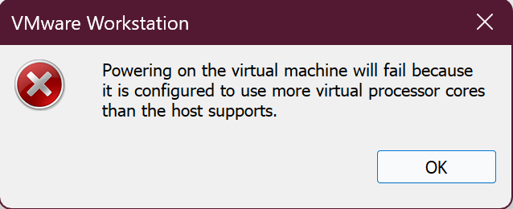
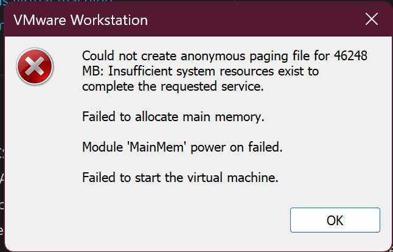

# KN01: Virtualisierung

## A) Hypervisor Typ 1 und 2 (30%)

### Was ist ein Hypervisor?

Ein Hypervisor ist eine Software, die virtuelle Maschinen (VMs) erstellt und verwaltet. Er ermöglicht es, mehrere Betriebssysteme gleichzeitig auf einem physischen Computer auszuführen, indem er die Hardware-Ressourcen wie CPU, RAM und Speicher zwischen den VMs aufteilt.

### Unterschied zwischen Hypervisor Typ 1 und Typ 2

**Hypervisor Typ 1 (Bare-Metal):**
- Läuft direkt auf der Hardware
- Bessere Performance
- Beispiele: VMware ESXi, Hyper-V, KVM

**Hypervisor Typ 2 (Hosted):**
- Läuft auf einem Betriebssystem
- Einfacher zu installieren
- Beispiele: VMware Workstation, VirtualBox

**Hauptunterschiede:**
- Typ 1 hat direkten Hardware-Zugriff, Typ 2 läuft über ein Host-OS
- Typ 1 ist effizienter für Server, Typ 2 besser für Desktop-Nutzung

---

## B) Virtualisierungssoftware (70%)

### Verwendete Virtualisierungssoftware

**Software:** VMware Workstation

**Gruppenmitglieder:**
- Goncalo de Almeida
- Simon
- Gino

### Vermutung zum Hypervisor Typ

**Unsere Vermutung:** Typ 2

**Begründung:**
VMware Workstation läuft als Anwendung auf Windows und benötigt ein Host-Betriebssystem.

---

### Test 1: CPU-Ressourcen

#### Host-System Spezifikationen
- **Anzahl logische Prozessoren:** 8 Kerne

#### VM-Konfiguration und Test
- **Zugewiesene CPU-Kerne an VM:** Versuch mit mehr als 8 Kernen
- **Screenshot Fehlermeldung:**

#### Ergebnis

**Beobachtung:**
VMware verhinderte den Start der VM mit der Meldung: "Powering on the virtual machine will fail because it is configured to use more virtual processor cores than the host supports." Es ist nicht möglich, mehr CPUs zuzuweisen als physisch vorhanden sind.

---

### Test 2: RAM-Ressourcen

#### Host-System Spezifikationen
- **Verfügbarer RAM:** ca. 32 GB

#### VM-Konfiguration und Test
- **Zugewiesener RAM an VM:** 46248 MB (ca. 45 GB)
- **Screenshot Fehlermeldung:**

#### Ergebnis

**Beobachtung:**
Die VM konnte nicht gestartet werden. Fehlermeldungen: "Could not create anonymous paging file for 46248 MB: Insufficient system resources", "Failed to allocate main memory". Das System hatte nicht genug verfügbare Ressourcen.

---

### Analyse und Schlussfolgerung

#### Fehlermeldungen / Einschränkungen

**CPU:** VM-Start wurde blockiert wegen zu vielen vCPUs
**RAM:** Speicher-Allokation ist fehlgeschlagen wegen unzureichender Ressourcen

#### Erklärung der Beobachtungen

**Warum konnten wir nicht mehr Ressourcen zuweisen als das Host-System hat?**

VMware Workstation ist ein Typ-2-Hypervisor und läuft auf Windows. Das bedeutet:

- **Technische Grenzen:** Das Host-OS verwaltet die Hardware. VMware kann nur Ressourcen nutzen, die Windows bereitstellt.

- **Unterschied Typ 1 vs Typ 2:** Typ-1-Hypervisoren haben direkten Hardware-Zugriff und können Overcommitment betreiben. Typ-2-Hypervisoren sind vom Host-OS abhängig.

- **Overcommitment:** Bei Typ 1 kann man mehr virtuelle Ressourcen zuweisen als physisch vorhanden (z.B. 16 vCPUs auf 8 Kernen). Bei Typ 2 ist dies nicht möglich, da das Host-OS die Kontrolle hat.

- **Logische vs physische Ressourcen:** Physische CPUs sind die echten Kerne im Prozessor. Logische CPUs entstehen durch Hyper-Threading (1 physischer Kern = 2 logische CPUs). Bei Typ-2-Hypervisoren kann man maximal so viele vCPUs zuweisen wie logische CPUs vorhanden sind.

#### Hat sich unsere Vermutung bestätigt?

**Antwort:** Ja

**Begründung:**
Die Tests bestätigen, dass VMware Workstation ein Typ-2-Hypervisor ist. Die strikten Ressourcen-Limits und die Abhängigkeit vom Host-OS sind typisch für Typ 2. Ein Typ-1-Hypervisor hätte mehr Flexibilität beim Overcommitment gehabt.

---

## Fazit

Wir haben gelernt, dass Typ-2-Hypervisoren wie VMware Workstation durch das Host-Betriebssystem limitiert sind. Die physischen Hardware-Grenzen können nicht überschritten werden, im Gegensatz zu Typ-1-Hypervisoren, die direkten Hardware-Zugriff haben und Overcommitment ermöglichen.
