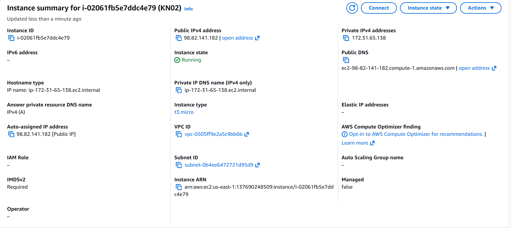
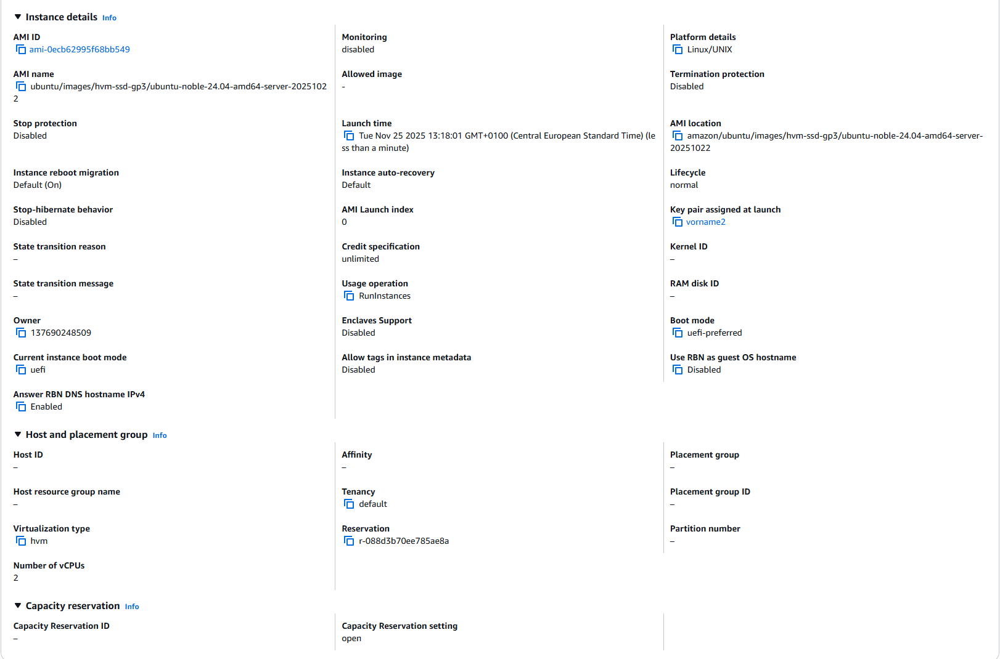
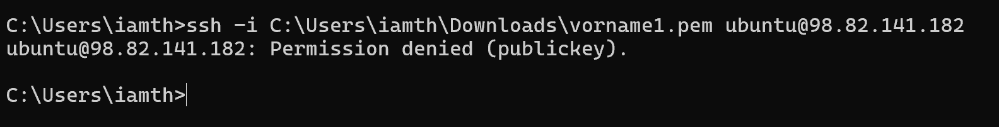
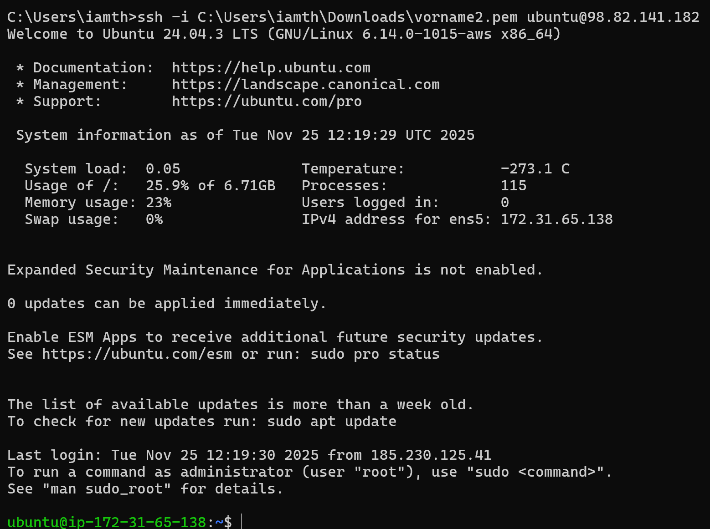

# KN02: IaaS - Virtuelle Server

## A) Umgang mit AWS Kurs (20%)

Ich habe erfolgreich den AWS Academy Learner Lab Account erstellt und kann auf die AWS-Konsole zugreifen.

**Wichtige Erkenntnisse:**
- Der grüne Kreis zeigt an, dass die Umgebung bereit ist
- Das Budget wird angezeigt und muss beachtet werden
- Die Umgebung läuft maximal 4 Stunden und muss dann neu gestartet werden
- EC2 ist der Bereich für virtuelle Server (Instanzen)

---

## B) Instanz erstellen (40%)

### Erstellte Instanz: KN02

#### Screenshot: Instanz Summary


#### Screenshot: Instanz Details


### Instanz-Spezifikationen:

| Eigenschaft | Wert |
|-------------|------|
| **Diskgrösse** | 8 GiB (gp3) |
| **Betriebssystem** | Ubuntu 24.04 LTS (ubuntu-noble-24.04-amd64-server-20251022) |
| **RAM** | 1 GiB |
| **Anzahl CPUs** | 2 vCPUs |
| **Instance Type** | t3.micro |
| **Public IP** | 98.82.141.182 |
| **Private IP** | 172.31.65.138 |
| **Key Pair** | vorname2 |
| **Instance ID** | i-02061fb5e7ddc4e79 |

---

## C) Zugriff mit SSH-Key (40%)

### SSH und Public/Private Key Verschlüsselung

**Funktionsweise:**

SSH (Secure Shell) verwendet Public-Key-Kryptographie für sichere Authentifizierung:

- **Private Key:** Wird lokal auf dem Client gespeichert und muss geheim bleiben. Dieser Schlüssel darf niemals weitergegeben werden.
- **Public Key:** Wird auf dem Server in der Datei `~/.ssh/authorized_keys` gespeichert. Dieser kann frei verteilt werden.

**Authentifizierungsprozess:**
1. Client sendet eine Verbindungsanfrage mit seinem Public Key
2. Server prüft, ob der Public Key in `authorized_keys` vorhanden ist
3. Server sendet eine verschlüsselte Challenge
4. Client entschlüsselt die Challenge mit seinem Private Key
5. Bei korrekter Antwort wird die Verbindung hergestellt

Bei AWS erstellt man ein Key-Pair beim Launch der Instanz. AWS speichert den Public Key auf der Instanz, und der Private Key wird einmalig heruntergeladen (kann nicht wiederhergestellt werden).

---

### Test 1: Zugriff mit dem falschen Schlüssel (vorname1)

**SSH-Befehl:**
```bash
ssh -i C:\Users\iamth\Downloads\vorname1.pem ubuntu@98.82.141.182
```

**Screenshot:**


**Ergebnis:**
Der Zugriff wurde verweigert mit der Meldung **"Permission denied (publickey)"**. Dies liegt daran, dass der Public Key von `vorname1` nicht auf der EC2-Instanz konfiguriert ist. Die Instanz akzeptiert nur den Key, der beim Launch ausgewählt wurde.

---

### Test 2: Zugriff mit dem richtigen Schlüssel (vorname2)

**SSH-Befehl:**
```bash
ssh -i C:\Users\iamth\Downloads\vorname2.pem ubuntu@98.82.141.182
```

**Screenshot:**


**Ergebnis:**
Der Login war **erfolgreich**! Die Verbindung wurde hergestellt und ich bin nun auf der Ubuntu-Instanz eingeloggt. Der Welcome-Screen zeigt:
- Ubuntu 24.04.3 LTS
- System-Informationen (Load, Memory, Disk Usage)
- Private IP: 172.31.65.138

---

### Verwendeter Key in der Instanz

**Screenshot:**


**Analyse:**

In den Instance Details (Screenshot) ist unter **"Key pair assigned at launch"** klar ersichtlich, dass **vorname2** der konfigurierte Key Pair ist.

**Warum funktioniert nur vorname2?**
- Beim Erstellen der EC2-Instanz wurde `vorname2` als Key Pair ausgewählt
- AWS hat den Public Key von `vorname2` automatisch in die Datei `/home/ubuntu/.ssh/authorized_keys` auf der Instanz eingetragen
- Der Public Key von `vorname1` wurde nie auf die Instanz übertragen
- SSH erlaubt nur Authentifizierung mit Keys, deren Public Key auf dem Server hinterlegt ist
- Daher funktioniert nur `vorname2.pem` für den Zugriff

**Sicherheitsaspekt:**
Dies zeigt das Sicherheitskonzept von SSH: Selbst wenn jemand einen anderen Private Key besitzt, kann er sich nicht einloggen, solange der zugehörige Public Key nicht auf dem Server autorisiert ist.
