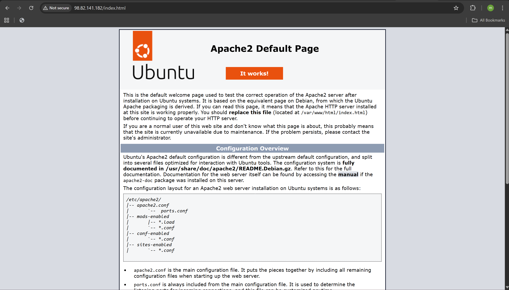
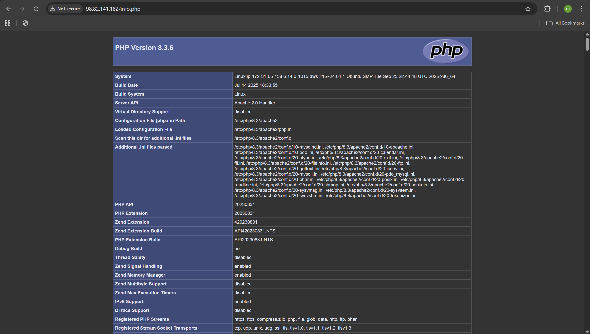
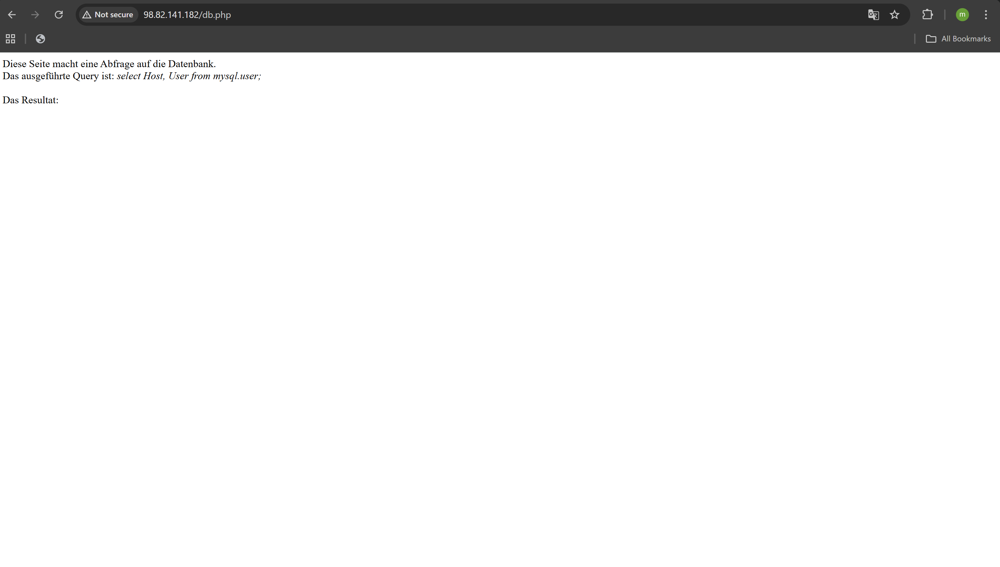
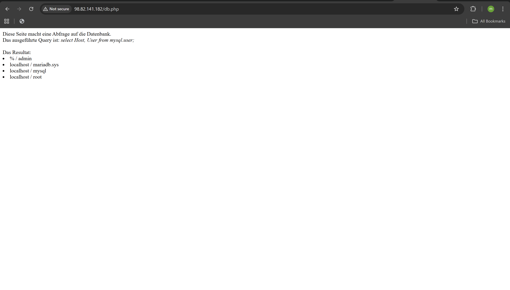
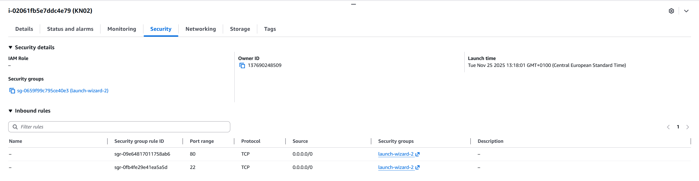
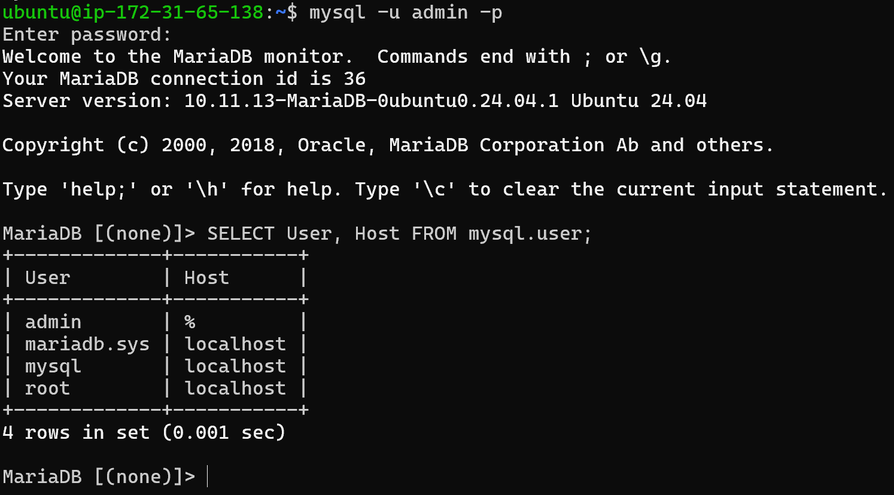

# KN03: Cloud-init und AWS

## Übersicht

In diesem Kompetenznachweis wurde ein LAMP-Stack (Linux, Apache, MySQL/MariaDB, PHP) auf einer AWS EC2 Ubuntu-Instanz installiert und konfiguriert.

---

## A) Installation der Software (60%)

### Verwendete EC2-Instanz

| Eigenschaft | Wert |
|-------------|------|
| **Instance ID** | i-02061fb5e7ddc4e79 |
| **Name** | KN02 |
| **Public IP** | 98.82.141.182 |
| **Betriebssystem** | Ubuntu 24.04 LTS |
| **Instance Type** | t3.micro |
| **RAM** | 1 GiB |
| **vCPUs** | 2 |
| **Disk** | 8 GiB (gp3) |
| **Key Pair** | vorname2 |

---

### Installationsbefehle

#### 1. System aktualisieren
```bash
sudo apt update && sudo apt upgrade -y
```
Aktualisiert die Paketlisten und installiert verfügbare Updates.

#### 2. Apache2 Webserver installieren
```bash
sudo apt install apache2 -y
```
Installiert den Apache2 HTTP-Server, der Webseiten über Port 80 bereitstellt.

#### 3. PHP installieren
```bash
sudo apt install php libapache2-mod-php php-mysql -y
```
Installiert:
- `php` - PHP Interpreter
- `libapache2-mod-php` - Apache-Modul für PHP-Unterstützung
- `php-mysql` - PHP-Erweiterung für MySQL/MariaDB-Datenbankverbindungen

#### 4. MariaDB installieren
```bash
sudo apt install mariadb-server -y
```
Installiert den MariaDB-Datenbankserver (MySQL-kompatibler Fork).

#### 5. Apache und MariaDB starten
```bash
sudo systemctl start apache2
sudo systemctl start mariadb
sudo systemctl enable apache2
sudo systemctl enable mariadb
```
Startet die Dienste und aktiviert den Autostart beim Systemboot.

---

### Datenbank-Benutzer erstellen

```bash
sudo mysql
```

```sql
CREATE USER 'admin'@'%' IDENTIFIED BY 'admin';
GRANT ALL PRIVILEGES ON *.* TO 'admin'@'%';
FLUSH PRIVILEGES;
EXIT;
```

Erstellt einen Benutzer `admin` mit Passwort `admin`, der von überall (`%`) zugreifen kann.

---

### PHP-Testdateien erstellen

#### info.php
```bash
sudo nano /var/www/html/info.php
```

```php
<?php
phpinfo();
?>
```

#### db.php
```bash
sudo nano /var/www/html/db.php
```

```php
<?php
$servername = "localhost";
$username = "admin";
$password = "admin";

// Create connection
$conn = new mysqli($servername, $username, $password);

// Check connection
if ($conn->connect_error) {
    die("Connection failed: " . $conn->connect_error);
}

$sql = "SELECT Host, User FROM mysql.user;";
$result = $conn->query($sql);

echo "Diese Seite macht eine Abfrage auf die Datenbank.<br>";
echo "Das ausgeführte Query ist: <em>" . $sql . "</em><br><br>";
echo "Das Resultat:<br>";

while($row = $result->fetch_assoc()) {
    echo "<li>" . $row["Host"] . " / " . $row["User"] . "</li>";
}
?>
```

---

### Fehlerbehebung: db.php zeigte kein Resultat

**Problem:** Die ursprüngliche db.php-Datei zeigte nur den Text ohne Datenbankresultat.

**Ursache:** Das Passwort in der db.php-Datei stimmte nicht mit dem tatsächlichen Datenbankpasswort überein.

**Lösung:** Das Passwort in db.php wurde auf `admin` geändert:
```php
$password = "admin";  // Korrigiertes Passwort
```

Nach der Korrektur wurden die MySQL-Benutzer korrekt angezeigt.

---

## B) Security Group Konfiguration

### Inbound Rules

| Port | Protokoll | Quelle | Beschreibung |
|------|-----------|--------|--------------|
| 22 | TCP | 0.0.0.0/0 | SSH-Zugriff |
| 80 | TCP | 0.0.0.0/0 | HTTP-Webserver |

Die Security Group `launch-wizard-2` wurde so konfiguriert, dass:
- **Port 22 (SSH):** Ermöglicht den Remote-Zugriff auf die Instanz via SSH
- **Port 80 (HTTP):** Ermöglicht den Zugriff auf den Apache-Webserver

---

## Screenshots

### Screenshot: Apache Default Page (index.html)


Die Apache2 Default Page zeigt "It works!" und bestätigt, dass der Webserver korrekt läuft.

---

### Screenshot: PHP Info Page (info.php)


Zeigt PHP Version 8.3.6 mit Apache 2.0 Handler und allen geladenen Modulen.

---

### Screenshot: Datenbank-Abfrage (db.php) - Ohne Resultat


Erste Version: Das Query wurde ausgeführt, aber kein Resultat angezeigt (falsches Passwort).

---

### Screenshot: Datenbank-Abfrage (db.php) - Mit Resultat


Nach Korrektur des Passworts zeigt die Seite die MySQL-Benutzer:
- `% / admin`
- `localhost / mariadb.sys`
- `localhost / mysql`
- `localhost / root`

---

### Screenshot: Security Group Inbound Rules


Zeigt die konfigurierten Inbound Rules für Port 22 (SSH) und Port 80 (HTTP).

---

### Screenshot: MySQL Konsole


Login mit `mysql -u admin -p` und Ausführung der SQL-Abfrage:
```sql
SELECT User, Host FROM mysql.user;
```

**Resultat:**
| User | Host |
|------|------|
| admin | % |
| mariadb.sys | localhost |
| mysql | localhost |
| root | localhost |

---

## Erklärung der SQL-Abfrage

```sql
SELECT User, Host FROM mysql.user;
```

Diese Abfrage:
1. **SELECT User, Host** - Wählt die Spalten `User` und `Host` aus
2. **FROM mysql.user** - Aus der System-Tabelle `mysql.user`, die alle Datenbankbenutzer enthält

**Ergebnis-Interpretation:**
- `admin @ %` - Der admin-Benutzer kann sich von jedem Host verbinden (`%` = Wildcard)
- `mariadb.sys @ localhost` - System-Benutzer, nur lokal
- `mysql @ localhost` - System-Benutzer, nur lokal
- `root @ localhost` - Root-Benutzer, nur lokaler Zugriff

---

## Installierte Software-Versionen

| Software | Version |
|----------|---------|
| Ubuntu | 24.04.3 LTS |
| Apache | 2.4.x |
| PHP | 8.3.6 |
| MariaDB | 10.11.13 |

---

## Zusammenfassung

Der LAMP-Stack wurde erfolgreich auf der AWS EC2-Instanz installiert:

1. **Apache2** - Webserver läuft auf Port 80
2. **PHP 8.3.6** - Korrekt als Apache-Modul eingebunden
3. **MariaDB 10.11.13** - Datenbankserver mit admin-Benutzer konfiguriert
4. **Security Group** - Ports 22 (SSH) und 80 (HTTP) geöffnet
5. **Testseiten** - index.html, info.php und db.php funktionieren korrekt
