# KN04: Cloud-init

## Übersicht

In diesem Kompetenznachweis wird Cloud-init analysiert und praktisch angewendet, um automatisierte Konfiguration von EC2-Instanzen zu verstehen und eine Zwei-Server-Architektur (Web + DB) zu implementieren.

**Gewichtung:**
- Teil A: Cloud-init verstehen (10%)
- Teil B: SSH-Key und Cloud-init (15%)
- Teil C: Template (5%)
- Teil D: Installation automatisieren (70%)

---

## A) Cloud-init Datei verstehen (10%)

### Cloud-init Konfigurationsdatei

Die vollständige Datei mit Dokumentation befindet sich in: [`cloud-init-example.yaml`](./cloud-init-example.yaml)

```yaml
#cloud-config
users:
  - name: ubuntu
    groups: [users, admin]
    shell: /bin/bash
    sudo: ALL=(ALL) NOPASSWD:ALL
    ssh_authorized_keys:
      - ssh-rsa AAAAB3NzaC1yc2EAAAADAQABAAABAQC0WGP1EZykEtv5YGC9nMiPFW3U3DmZNzKFO5nEu6uozEHh4jLZzPNHSrfFTuQ2GnRDSt+XbOtTLdcj26+iPNiFoFha42aCIzYjt6V8Z+SQ9pzF4jPPzxwXfDdkEWylgoNnZ+4MG1lNFqa8aO7F62tX0Yj5khjC0Bs7Mb2cHLx1XZaxJV6qSaulDuBbLYe8QUZXkMc7wmob3PM0kflfolR3LE7LResIHWa4j4FL6r5cQmFlDU2BDPpKMFMGUfRSFiUtaWBNXFOWHQBC2+uKmuMPYP4vJC9sBgqMvPN/X2KyemqdMvdKXnCfrzadHuSSJYEzD64Cve5Zl9yVvY4AqyBD aws-key
ssh_pwauth: false
disable_root: false
package_update: true
packages:
  - curl
  - wget
```

### Erklärung jeder Zeile

| Zeile | Erklärung |
|-------|-----------|
| `#cloud-config` | Kennzeichnet die Datei als Cloud-Init Konfiguration (YAML-Format, **muss erste Zeile sein**) |
| `users:` | Beginn der Benutzerdefinition |
| `- name: ubuntu` | Erstellt/konfiguriert den Benutzer "ubuntu" |
| `groups: [users, admin]` | Fügt den Benutzer zu den Gruppen "users" und "admin" hinzu |
| `shell: /bin/bash` | Setzt Bash als Standard-Shell für den Benutzer |
| `sudo: ALL=(ALL) NOPASSWD:ALL` | Erlaubt sudo-Befehle ohne Passwortabfrage |
| `ssh_authorized_keys:` | Liste der autorisierten SSH Public Keys |
| `- ssh-rsa AAAA...` | Der öffentliche SSH-Schlüssel für passwortlose Authentifizierung |
| `ssh_pwauth: false` | Deaktiviert Passwort-Login über SSH (nur Key-basiert) |
| `disable_root: false` | Root-Benutzer bleibt aktiv (nicht deaktiviert) |
| `package_update: true` | Führt `apt update` beim ersten Boot aus |
| `packages:` | Liste der zu installierenden Pakete |
| `- curl` | Installiert curl (HTTP-Request Tool) |
| `- wget` | Installiert wget (Download Tool) |

---

## B) SSH-Key und Cloud-init (15%)

### Ziel

Demonstration, dass Cloud-init die GUI-Einstellungen überschreiben kann. Eine Instanz wird mit **vorname2** im GUI erstellt, aber nur **vorname1** wird via Cloud-init autorisiert.

### Vorgehensweise

1. **Public Key extrahieren** aus den Private Keys:
   ```bash
   ssh-keygen -y -f vorname1.pem > vorname1_public.pub
   ssh-keygen -y -f vorname2.pem > vorname2_public.pub
   ```

2. **Neue Instanz erstellen** mit folgenden Einstellungen:
   - Name: KN04-B
   - OS: Ubuntu 24.04 LTS
   - Instance Type: t3.micro
   - Key Pair (GUI): **vorname2** ausgewählt
   - User Data: Cloud-init mit **vorname1** Public Key

### Cloud-init Konfiguration (User Data)

Die vollständige Datei: [`cloud-init-b.yaml`](./cloud-init-b.yaml)

```yaml
#cloud-config
users:
  - name: ubuntu
    sudo: ALL=(ALL) NOPASSWD:ALL
    groups: users, admin
    shell: /bin/bash
    ssh_authorized_keys:
      - ssh-rsa AAAAB3NzaC1yc2EAAAADAQABAAABAQDEt1OjtorQ8NSEJp/u1XCESB3+sayt9CqEZmrFwjM2wRvtN9xY9knpySmKnbshpeGto15h5kVDc1fkqxIG7GUqP27V441bql+YOmiD/yQjwhXt23d6H9CqWEm+LrDx0J54A0EHaKs4gAG1g2cq4/f8u7+MJMI6lLjdeGdB9q31MsxhH4dLaCo1N+QLeQSdrAmDQNwYOMhSNSMRRv+iZpKPCl4xx1CAnA0YqOWHUpYhN+O9JjJJRqEJm0Wsb3J3rmFAvHeGE4CAUq+wd+w3rnzp5ZwZwGNWQDVqzIA0J6uexHF9TnBmeWnt8zl74PL3SP/LAMtw4KE0v56batcI49DP aws-key
ssh_pwauth: false
disable_root: false
```

### Instanz Details

| Eigenschaft | Wert |
|-------------|------|
| **Name** | KN04-B |
| **Instance ID** | i-0963398105eb58388 |
| **Public IP** | 44.220.247.21 |
| **Private IP** | 172.31.67.31 |
| **Instance Type** | t3.micro |
| **OS** | Ubuntu 24.04 LTS |
| **Key Pair (GUI)** | vorname2 |
| **vCPUs** | 2 |

---

### SSH-Tests

#### Test 1: SSH mit vorname1.pem

```bash
ssh -i C:\Users\iamth\Downloads\vorname1.pem ubuntu@44.220.247.21
```

**Ergebnis:** ✅ **ERFOLGREICH**

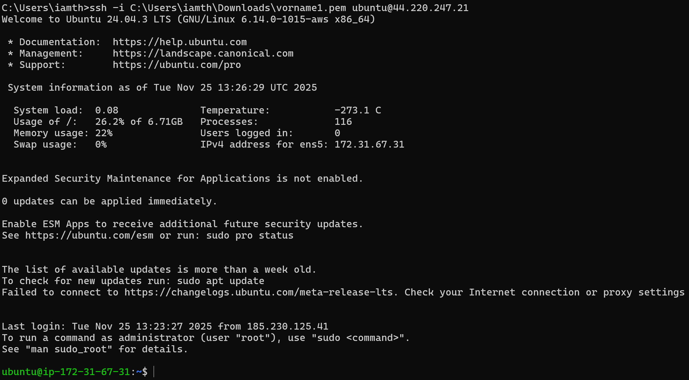

Der Login funktioniert, da der Public Key von vorname1 in der Cloud-init Konfiguration hinterlegt ist.

---

#### Test 2: SSH mit vorname2.pem

```bash
ssh -i C:\Users\iamth\Downloads\vorname2.pem ubuntu@44.220.247.21
```

**Ergebnis:** ❌ **FEHLGESCHLAGEN**

```
ubuntu@44.220.247.21: Permission denied (publickey).
```


---

### Erklärung: Warum funktioniert nur vorname1?

| Aspekt | Erklärung |
|--------|-----------|
| **GUI-Auswahl** | Im AWS GUI wurde `vorname2` als Key Pair ausgewählt |
| **Cloud-init Priorität** | Cloud-init überschreibt die GUI-Einstellungen |
| **ssh_authorized_keys** | Nur der Public Key von `vorname1` ist in der Cloud-init Datei definiert |
| **ssh_pwauth: false** | Passwort-Login ist deaktiviert, nur Key-Auth möglich |
| **Resultat** | Nur `vorname1.pem` kann sich authentifizieren |

**Kernpunkt:** Cloud-init hat eine höhere Priorität als die GUI-Einstellungen bei der Benutzerkonfiguration. Der in `ssh_authorized_keys` definierte Key ist der einzige autorisierte Schlüssel.

---

### Screenshots Teil B

#### Instanz Details KN04-B
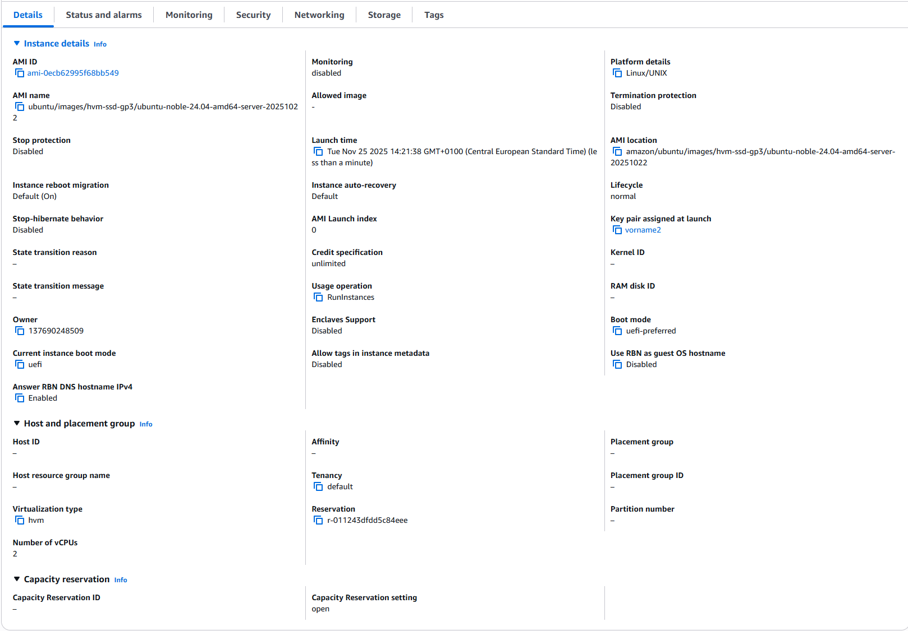

Zeigt "Key pair assigned at launch: **vorname2**" - aber durch Cloud-init wird nur vorname1 autorisiert.

---

### Cloud-Init Log

#### Cloud-Init Output Log


Der Cloud-Init Log zeigt:
- Cloud-init Version 25.2
- Netzwerk-Konfiguration (Private IP: 172.31.67.31)
- SSH-Key Generierung
- Erfolgreiche Ausführung der Cloud-Init Konfiguration

**Befehl:**
```bash
sudo cat /var/log/cloud-init-output.log | head -50
```

Dieser Log ist sehr nützlich für Debugging, falls die Cloud-Init Konfiguration fehlschlägt.

---

## C) Template (5%)

### Cloud-init Template für zukünftige Instanzen

Die vollständige Datei: [`cloud-init-template.yaml`](./cloud-init-template.yaml)

Dieses Template enthält beide SSH Public Keys (eigener + Lehrperson) und ist bereit für zukünftige Instanzen.

```yaml
#cloud-config
users:
  - name: ubuntu
    sudo: ALL=(ALL) NOPASSWD:ALL
    groups: users, admin
    shell: /bin/bash
    ssh_authorized_keys:
      - ssh-rsa AAAAB3NzaC1yc2EAAAADAQABAAABAQDEt1OjtorQ8NSEJp/u1XCESB3+sayt9CqEZmrFwjM2wRvtN9xY9knpySmKnbshpeGto15h5kVDc1fkqxIG7GUqP27V441bql+YOmiD/yQjwhXt23d6H9CqWEm+LrDx0J54A0EHaKs4gAG1g2cq4/f8u7+MJMI6lLjdeGdB9q31MsxhH4dLaCo1N+QLeQSdrAmDQNwYOMhSNSMRRv+iZpKPCl4xx1CAnA0YqOWHUpYhN+O9JjJJRqEJm0Wsb3J3rmFAvHeGE4CAUq+wd+w3rnzp5ZwZwGNWQDVqzIA0J6uexHF9TnBmeWnt8zl74PL3SP/LAMtw4KE0v56batcI49DP aws-key
      - ssh-rsa AAAAB3NzaC1yc2EAAAADAQABAAABAQC0WGP1EZykEtv5YGC9nMiPFW3U3DmZNzKFO5nEu6uozEHh4jLZzPNHSrfFTuQ2GnRDSt+XbOtTLdcj26+iPNiFoFha42aCIzYjt6V8Z+SQ9pzF4jPPzxwXfDdkEWylgoNnZ+4MG1lNFqa8aO7F62tX0Yj5khjC0Bs7Mb2cHLx1XZaxJV6qSaulDuBbLYe8QUZXkMc7wmob3PM0kflfolR3LE7LResIHWa4j4FL6r5cQmFlDU2BDPpKMFMGUfRSFiUtaWBNXFOWHQBC2+uKmuMPYP4vJC9sBgqMvPN/X2KyemqdMvdKXnCfrzadHuSSJYEzD64Cve5Zl9yVvY4AqyBD teacher-key
ssh_pwauth: false
disable_root: false
package_update: true
packages:
  - curl
  - wget
```

**Verwendung:** Dieses Template kann als Basis für alle zukünftigen Instanzen verwendet werden.

---

## D) Installation automatisieren (70%)

### Architektur-Übersicht

```
┌─────────────────────────────────────────────────────────────┐
│                         Internet                            │
└─────────────────────────────────────────────────────────────┘
                              │
                              │ HTTP (Port 80)
                              ▼
                    ┌──────────────────────┐
                    │    KN04-Web          │
                    │  3.235.41.82         │
                    │  (Apache, PHP,       │
                    │   Adminer)           │
                    └──────────────────────┘
                              │
                              │ MySQL (Port 3306)
                              │ Private IP: 172.31.66.95
                              ▼
                    ┌──────────────────────┐
                    │    KN04-DB           │
                    │  44.200.113.112      │
                    │  (MariaDB)           │
                    └──────────────────────┘
```

---

### 1. Datenbank-Server (KN04-DB)

#### Instanz Details

| Eigenschaft | Wert |
|-------------|------|
| **Name** | KN04-DB |
| **Public IP** | 44.200.113.112 |
| **Private IP** | 172.31.66.95 |
| **Instance Type** | t3.micro |
| **OS** | Ubuntu 24.04 LTS |
| **Security Group** | Port 22 (SSH), Port 3306 (MySQL) |
| **Key Pair** | vorname2 |

#### Cloud-init Konfiguration

Die vollständige Datei: [`cloud-init-db.yaml`](./cloud-init-db.yaml)

```yaml
#cloud-config
users:
  - name: ubuntu
    sudo: ALL=(ALL) NOPASSWD:ALL
    groups: users, admin
    shell: /bin/bash
    ssh_authorized_keys:
      - ssh-rsa AAAAB3NzaC1yc2EAAAADAQABAAABAQDEt1OjtorQ8NSEJp/u1XCESB3+sayt9CqEZmrFwjM2wRvtN9xY9knpySmKnbshpeGto15h5kVDc1fkqxIG7GUqP27V441bql+YOmiD/yQjwhXt23d6H9CqWEm+LrDx0J54A0EHaKs4gAG1g2cq4/f8u7+MJMI6lLjdeGdB9q31MsxhH4dLaCo1N+QLeQSdrAmDQNwYOMhSNSMRRv+iZpKPCl4xx1CAnA0YqOWHUpYhN+O9JjJJRqEJm0Wsb3J3rmFAvHeGE4CAUq+wd+w3rnzp5ZwZwGNWQDVqzIA0J6uexHF9TnBmeWnt8zl74PL3SP/LAMtw4KE0v56batcI49DP aws-key
      - ssh-rsa AAAAB3NzaC1yc2EAAAADAQABAAABAQC0WGP1EZykEtv5YGC9nMiPFW3U3DmZNzKFO5nEu6uozEHh4jLZzPNHSrfFTuQ2GnRDSt+XbOtTLdcj26+iPNiFoFha42aCIzYjt6V8Z+SQ9pzF4jPPzxwXfDdkEWylgoNnZ+4MG1lNFqa8aO7F62tX0Yj5khjC0Bs7Mb2cHLx1XZaxJV6qSaulDuBbLYe8QUZXkMc7wmob3PM0kflfolR3LE7LResIHWa4j4FL6r5cQmFlDU2BDPpKMFMGUfRSFiUtaWBNXFOWHQBC2+uKmuMPYP4vJC9sBgqMvPN/X2KyemqdMvdKXnCfrzadHuSSJYEzD64Cve5Zl9yVvY4AqyBD teacher-key

ssh_pwauth: false
disable_root: false

package_update: true
packages:
  - mariadb-server

runcmd:
  - sudo mysql -sfu root -e "GRANT ALL ON *.* TO 'admin'@'%' IDENTIFIED BY 'admin' WITH GRANT OPTION;"
  - sudo sed -i 's/127.0.0.1/0.0.0.0/g' /etc/mysql/mariadb.conf.d/50-server.cnf
  - sudo systemctl restart mariadb.service
```

#### Erklärung der Konfiguration

| Abschnitt | Erklärung |
|-----------|-----------|
| `package_update: true` | Aktualisiert Paketlisten |
| `packages: - mariadb-server` | Installiert MariaDB Server |
| `runcmd:` | Befehle die nach der Installation ausgeführt werden |
| `GRANT ALL ON *.*...` | Erstellt Benutzer `admin` mit Passwort `admin` und erlaubt Zugriff von überall (`@'%'`) |
| `sed -i 's/127.0.0.1/0.0.0.0/g'...` | Ändert `bind-address` von `127.0.0.1` auf `0.0.0.0` um externe Verbindungen zu erlauben |
| `systemctl restart mariadb` | Startet MariaDB neu um Änderungen anzuwenden |

#### Screenshots DB-Server

##### Instanz Summary
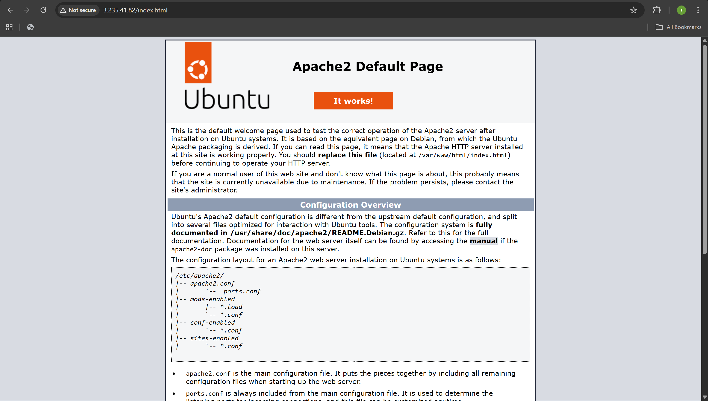

##### Instanz Details
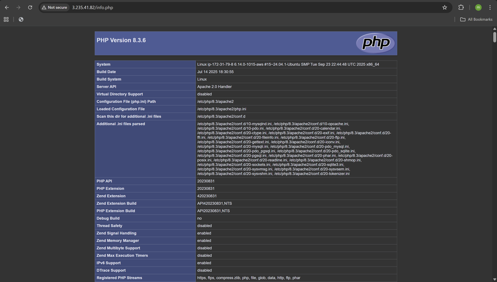

##### bind-address Verifikation
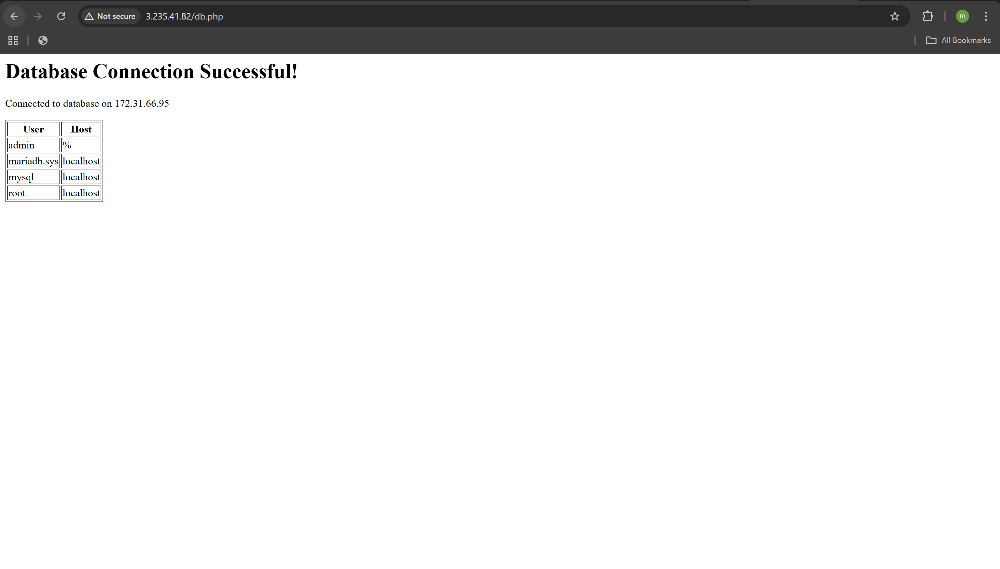

Zeigt `bind-address = 0.0.0.0` nach der Änderung durch Cloud-init.

---

### 2. Web-Server (KN04-Web)

#### Instanz Details

| Eigenschaft | Wert |
|-------------|------|
| **Name** | KN04-Web |
| **Public IP** | 3.235.41.82 |
| **Private IP** | 172.31.79.8 |
| **Instance Type** | t3.micro |
| **OS** | Ubuntu 24.04 LTS |
| **Security Group** | Port 22 (SSH), Port 80 (HTTP) |
| **Key Pair** | vorname2 |

#### Cloud-init Konfiguration

Die vollständige Datei: [`cloud-init-web.yaml`](./cloud-init-web.yaml)

```yaml
#cloud-config
users:
  - name: ubuntu
    sudo: ALL=(ALL) NOPASSWD:ALL
    groups: users, admin
    shell: /bin/bash
    ssh_authorized_keys:
      - ssh-rsa AAAAB3NzaC1yc2EAAAADAQABAAABAQDEt1OjtorQ8NSEJp/u1XCESB3+sayt9CqEZmrFwjM2wRvtN9xY9knpySmKnbshpeGto15h5kVDc1fkqxIG7GUqP27V441bql+YOmiD/yQjwhXt23d6H9CqWEm+LrDx0J54A0EHaKs4gAG1g2cq4/f8u7+MJMI6lLjdeGdB9q31MsxhH4dLaCo1N+QLeQSdrAmDQNwYOMhSNSMRRv+iZpKPCl4xx1CAnA0YqOWHUpYhN+O9JjJJRqEJm0Wsb3J3rmFAvHeGE4CAUq+wd+w3rnzp5ZwZwGNWQDVqzIA0J6uexHF9TnBmeWnt8zl74PL3SP/LAMtw4KE0v56batcI49DP aws-key
      - ssh-rsa AAAAB3NzaC1yc2EAAAADAQABAAABAQC0WGP1EZykEtv5YGC9nMiPFW3U3DmZNzKFO5nEu6uozEHh4jLZzPNHSrfFTuQ2GnRDSt+XbOtTLdcj26+iPNiFoFha42aCIzYjt6V8Z+SQ9pzF4jPPzxwXfDdkEWylgoNnZ+4MG1lNFqa8aO7F62tX0Yj5khjC0Bs7Mb2cHLx1XZaxJV6qSaulDuBbLYe8QUZXkMc7wmob3PM0kflfolR3LE7LResIHWa4j4FL6r5cQmFlDU2BDPpKMFMGUfRSFiUtaWBNXFOWHQBC2+uKmuMPYP4vJC9sBgqMvPN/X2KyemqdMvdKXnCfrzadHuSSJYEzD64Cve5Zl9yVvY4AqyBD teacher-key

ssh_pwauth: false
disable_root: false

package_update: true
packages:
  - apache2
  - php
  - libapache2-mod-php
  - php-mysql
  - adminer

write_files:
  - path: /var/www/html/info.php
    content: |
      <?php
      phpinfo();
      ?>

  - path: /var/www/html/db.php
    content: |
      <?php
      $servername = "172.31.66.95";
      $username = "admin";
      $password = "admin";
      $dbname = "mysql";

      $conn = new mysqli($servername, $username, $password, $dbname);

      if ($conn->connect_error) {
          die("Connection failed: " . $conn->connect_error);
      }

      echo "<h1>Database Connection Successful!</h1>";
      echo "<p>Connected to database on " . $servername . "</p>";

      $sql = "SELECT User, Host FROM mysql.user";
      $result = $conn->query($sql);

      if ($result->num_rows > 0) {
          echo "<table border='1'><tr><th>User</th><th>Host</th></tr>";
          while($row = $result->fetch_assoc()) {
              echo "<tr><td>" . $row["User"]. "</td><td>" . $row["Host"]. "</td></tr>";
          }
          echo "</table>";
      }
      $conn->close();
      ?>

runcmd:
  - sudo a2enconf adminer
  - sudo systemctl restart apache2
```

#### Erklärung der Konfiguration

| Abschnitt | Erklärung |
|-----------|-----------|
| `packages:` | Installiert Apache2, PHP, PHP-Module, und Adminer |
| `write_files:` | Erstellt PHP-Dateien direkt beim Boot |
| `info.php` | Zeigt PHP-Info Seite |
| `db.php` | Verbindet sich zur DB auf **172.31.66.95** (Private IP von KN04-DB) |
| `$servername = "172.31.66.95"` | Verwendet die Private IP des DB-Servers |
| `runcmd:` | Aktiviert Adminer und startet Apache neu |

#### Screenshots Web-Server

##### Instanz Summary
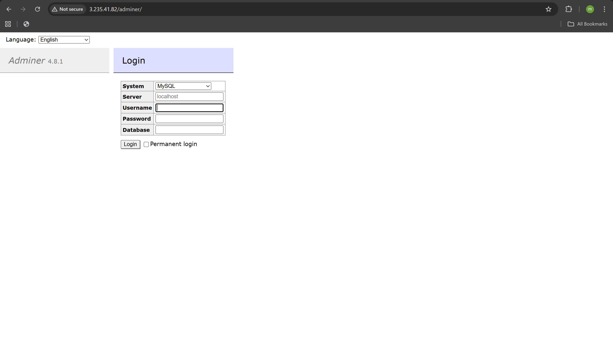

##### Instanz Details
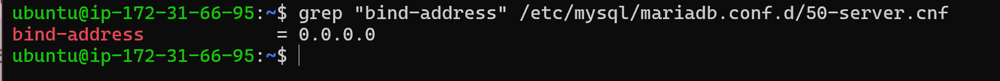

---

### 3. Webseiten Tests

#### index.html - Apache Default Page
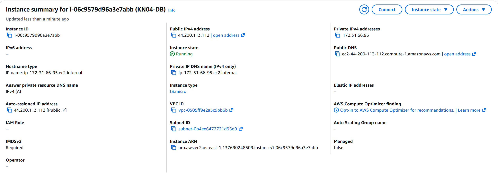

URL: `http://3.235.41.82/index.html`

Zeigt "It works!" - Apache läuft erfolgreich.

---

#### info.php - PHP Info
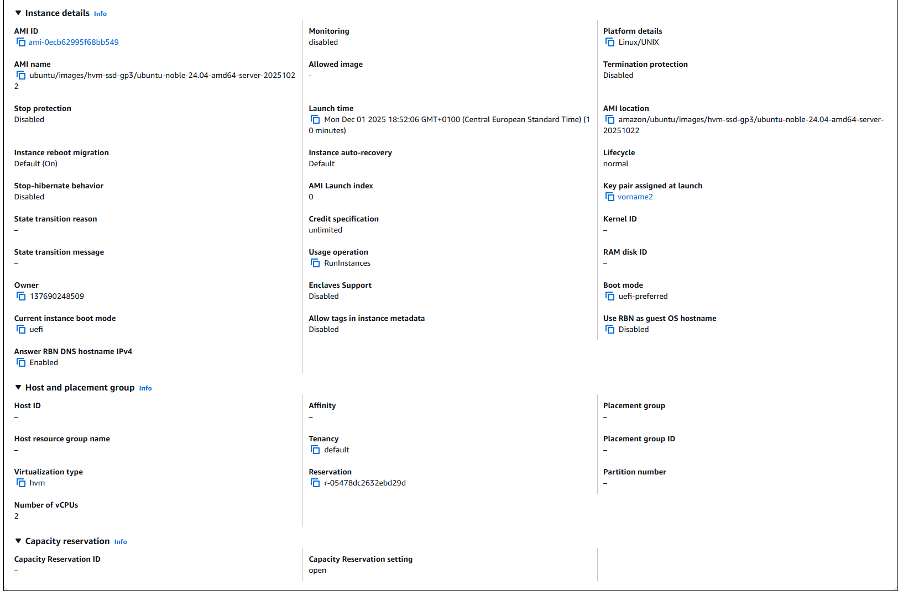

URL: `http://3.235.41.82/info.php`

Zeigt PHP Version 8.3.6 und alle geladenen Module.

---

#### db.php - Datenbankverbindung
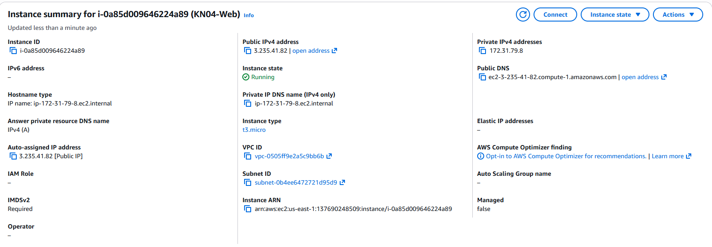

URL: `http://3.235.41.82/db.php`

**Ergebnis:**
- "Database Connection Successful!"
- "Connected to database on 172.31.66.95"
- Tabelle mit MySQL-Benutzern

Dies beweist, dass der Web-Server erfolgreich mit dem DB-Server kommuniziert.

---

#### Adminer - Login
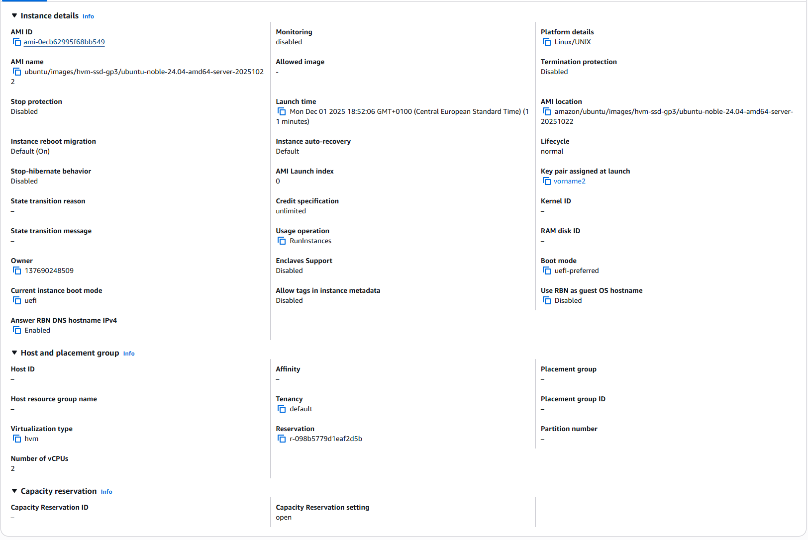

URL: `http://3.235.41.82/adminer/`

Zeigt Adminer Login-Screen.

**Login-Daten:**
- Server: 172.31.66.95
- Username: admin
- Password: admin

---

#### Adminer - Eingeloggt
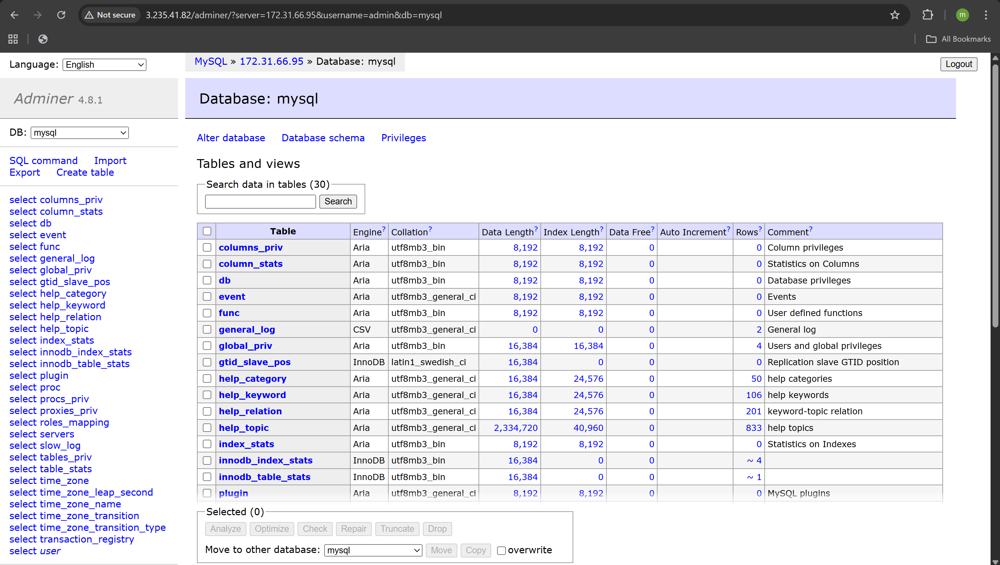

Nach erfolgreichem Login zeigt Adminer die Datenbankstruktur und erlaubt Verwaltung der MariaDB-Instanz auf KN04-DB.

---

## Erkenntnisse

### Cloud-init Vorteile

1. **Automatisierung:** Vollständige Server-Konfiguration ohne manuelle Eingriffe
2. **Reproduzierbarkeit:** Identische Konfiguration bei jedem Boot
3. **Versionierung:** YAML-Dateien können in Git versioniert werden
4. **Skalierbarkeit:** Einfache Erstellung mehrerer identischer Instanzen

### Architektur-Prinzipien

1. **Private IP für interne Kommunikation:** Web-Server verwendet die Private IP (172.31.66.95) des DB-Servers
2. **Security Groups:** Nur notwendige Ports sind geöffnet
3. **Trennung von Web und DB:** Erhöht Sicherheit und Wartbarkeit

### Cloud-init Log

Der vollständige Cloud-Init Log befindet sich auf jeder Instanz unter:
```bash
/var/log/cloud-init-output.log
```

Nützlich für Debugging bei Problemen.

---

## Zusammenfassung

| Teil | Beschreibung | Status |
|------|--------------|--------|
| A | Cloud-init YAML analysiert und erklärt | ✅ |
| B | Instanz mit Cloud-init erstellt, SSH-Key Priorität demonstriert | ✅ |
| C | Template mit beiden SSH-Keys erstellt | ✅ |
| D | Zwei-Server-Architektur (Web + DB) vollständig automatisiert | ✅ |

**Ergebnis:** Eine vollständig funktionierende Web-Anwendung mit Datenbankanbindung, die durch Cloud-init automatisch konfiguriert wurde.
