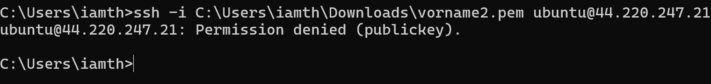
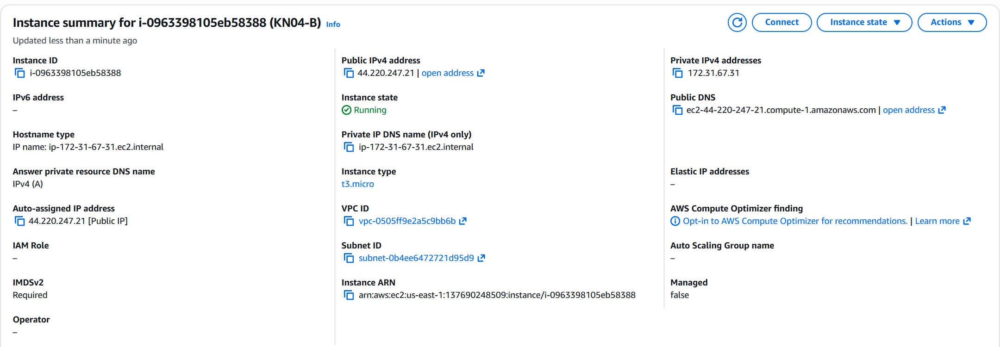

# KN04: Cloud-init

## Übersicht

In diesem Kompetenznachweis wird Cloud-init analysiert und praktisch angewendet, um zu verstehen, wie automatisierte Konfiguration von EC2-Instanzen funktioniert.

---

## A) Cloud-init Datei verstehen (10%)

### Cloud-init Konfigurationsdatei

```yaml
#cloud-config
users:
  - name: ubuntu
    groups: [users, admin]
    shell: /bin/bash
    sudo: ALL=(ALL) NOPASSWD:ALL
    ssh_authorized_keys:
      - ssh-rsa AAAAB3NzaC1yc2EAAAADAQABAAABAQC0WGP1EZykEtv5YGC9nMiPFW3U3DmZNzKFO5nEu6uozEHh4jLZzPNHSrfFTuQ2GnRDSt+XbOtTLdcj26+iPNiFoFha42aCIzYjt6V8Z+SQ9pzF4jPPzxwXfDdkEWylgoNnZ+4MG1lNFqa8aO7F62tX0Yj5khjC0Bs7Mb2cHLx1XZaxJV6qSaulDuBbLYe8QUZXkMc7wmob3PM0kflfolR3LE7LResIHWa4j4FL6r5cQmFlDU2BDPpKMFMGUfRSFiUtaWBNXFOWHQBC2+uKmuMPYP4vJC9sBgqMvPN/X2KyemqdMvdKXnCfrzadHuSSJYEzD64Cve5Zl9yVvY4AqyBD aws-key
ssh_pwauth: false
disable_root: false
package_update: true
packages:
  - curl
  - wget
```

### Erklärung jeder Zeile

| Zeile | Erklärung |
|-------|-----------|
| `#cloud-config` | Kennzeichnet die Datei als Cloud-Init Konfiguration (YAML-Format) |
| `users:` | Beginn der Benutzerdefinition |
| `- name: ubuntu` | Erstellt/konfiguriert den Benutzer "ubuntu" |
| `groups: [users, admin]` | Fügt den Benutzer zu den Gruppen "users" und "admin" hinzu |
| `shell: /bin/bash` | Setzt Bash als Standard-Shell für den Benutzer |
| `sudo: ALL=(ALL) NOPASSWD:ALL` | Erlaubt sudo-Befehle ohne Passwortabfrage |
| `ssh_authorized_keys:` | Liste der autorisierten SSH Public Keys |
| `- ssh-rsa AAAA...` | Der öffentliche SSH-Schlüssel für passwortlose Authentifizierung |
| `ssh_pwauth: false` | Deaktiviert Passwort-Login über SSH (nur Key-basiert) |
| `disable_root: false` | Root-Benutzer bleibt aktiv (nicht deaktiviert) |
| `package_update: true` | Führt `apt update` beim ersten Boot aus |
| `packages:` | Liste der zu installierenden Pakete |
| `- curl` | Installiert curl (HTTP-Request Tool) |
| `- wget` | Installiert wget (Download Tool) |

---

## B) SSH-Key und Cloud-init (15%)

### Ziel

Demonstration, dass Cloud-init die GUI-Einstellungen überschreiben kann. Eine Instanz wird mit **vorname2** im GUI erstellt, aber nur **vorname1** wird via Cloud-init autorisiert.

### Vorgehensweise

1. **Public Key extrahieren** aus den Private Keys:
   ```bash
   ssh-keygen -y -f vorname1.pem > vorname1_public.pub
   ssh-keygen -y -f vorname2.pem > vorname2_public.pub
   ```

2. **Neue Instanz erstellen** mit folgenden Einstellungen:
   - Name: KN04-B
   - OS: Ubuntu 24.04 LTS
   - Instance Type: t3.micro
   - Key Pair (GUI): **vorname2** ausgewählt
   - User Data: Cloud-init mit **vorname1** Public Key

### Cloud-init Konfiguration (User Data)

```yaml
#cloud-config
users:
  - name: ubuntu
    sudo: ALL=(ALL) NOPASSWD:ALL
    groups: users, admin
    shell: /bin/bash
    ssh_authorized_keys:
      - ssh-rsa AAAAB3NzaC1yc2EAAAADAQABAAABAQDEt1OjtorQ8NSEJp/u1XCESB3+sayt9CqEZmrFwjM2wRvtN9xY9knpySmKnbshpeGto15h5kVDc1fkqxIG7GUqP27V441bql+YOmiD/yQjwhXt23d6H9CqWEm+LrDx0J54A0EHaKs4gAG1g2cq4/f8u7+MJMI6lLjdeGdB9q31MsxhH4dLaCo1N+QLeQSdrAmDQNwYOMhSNSMRRv+iZpKPCl4xx1CAnA0YqOWHUpYhN+O9JjJJRqEJm0Wsb3J3rmFAvHeGE4CAUq+wd+w3rnzp5ZwZwGNWQDVqzIA0J6uexHF9TnBmeWnt8zl74PL3SP/LAMtw4KE0v56batcI49DP aws-key
ssh_pwauth: false
disable_root: false
```

### Instanz Details

| Eigenschaft | Wert |
|-------------|------|
| **Name** | KN04-B |
| **Instance ID** | i-0963398105eb58388 |
| **Public IP** | 44.220.247.21 |
| **Private IP** | 172.31.67.31 |
| **Instance Type** | t3.micro |
| **OS** | Ubuntu 24.04 LTS |
| **Key Pair (GUI)** | vorname2 |
| **vCPUs** | 2 |

---

### SSH-Tests

#### Test 1: SSH mit vorname1.pem

```bash
ssh -i C:\Users\iamth\Downloads\vorname1.pem ubuntu@44.220.247.21
```

**Ergebnis:** ✅ **ERFOLGREICH**


Der Login funktioniert, da der Public Key von vorname1 in der Cloud-init Konfiguration hinterlegt ist.

---

#### Test 2: SSH mit vorname2.pem

```bash
ssh -i C:\Users\iamth\Downloads\vorname2.pem ubuntu@44.220.247.21
```

**Ergebnis:** ❌ **FEHLGESCHLAGEN**

```
ubuntu@44.220.247.21: Permission denied (publickey).
```



---

### Erklärung: Warum funktioniert nur vorname1?

| Aspekt | Erklärung |
|--------|-----------|
| **GUI-Auswahl** | Im AWS GUI wurde `vorname2` als Key Pair ausgewählt |
| **Cloud-init Priorität** | Cloud-init überschreibt die GUI-Einstellungen |
| **ssh_authorized_keys** | Nur der Public Key von `vorname1` ist in der Cloud-init Datei definiert |
| **ssh_pwauth: false** | Passwort-Login ist deaktiviert, nur Key-Auth möglich |
| **Resultat** | Nur `vorname1.pem` kann sich authentifizieren |

**Kernpunkt:** Cloud-init hat eine höhere Priorität als die GUI-Einstellungen bei der Benutzerkonfiguration. Der in `ssh_authorized_keys` definierte Key ist der einzige autorisierte Schlüssel.

---

### Screenshots

#### Instanz Summary


#### Instanz Details (Key Pair sichtbar)


Zeigt "Key pair assigned at launch: **vorname2**" - aber durch Cloud-init wird nur vorname1 autorisiert.

---

### Cloud-Init Log

Der Cloud-Init Log befindet sich auf der Instanz unter:
```
/var/log/cloud-init-output.log
```

Zum Anzeigen:
```bash
sudo cat /var/log/cloud-init-output.log
```

---

## Erkenntnisse

1. **Cloud-init Priorität:** User Data (Cloud-init) überschreibt GUI-Einstellungen für SSH-Keys
2. **Sicherheit:** `ssh_pwauth: false` erzwingt Key-basierte Authentifizierung
3. **Flexibilität:** Cloud-init ermöglicht vollständige Kontrolle über die Instanz-Konfiguration beim ersten Boot
4. **Automatisierung:** Pakete können automatisch installiert werden (`packages:`)

## Zusammenfassung

| Teil | Beschreibung | Status |
|------|--------------|--------|
| A | Cloud-init YAML analysiert und erklärt | ✅ |
| B | Instanz mit Cloud-init erstellt, SSH-Key Verhalten demonstriert | ✅ |

Die praktische Demonstration zeigt, dass Cloud-init die zentrale Methode zur automatisierten Konfiguration von EC2-Instanzen ist und GUI-Einstellungen überschreiben kann.
