# KN05: Netzwerk / Sicherheit

## Übersicht

In diesem Kompetenznachweis wird das AWS-Netzwerk detailliert konfiguriert. VPC, Subnets, Security Groups und statische IPs werden gezielt geplant und eingesetzt, um eine sichere Zwei-Server-Architektur (Web + DB) zu erstellen.

**Gewichtung:**
- Teil A: Grundbegriffe und private IP wählen (30%)
- Teil B: Objekte und Instanzen erstellen (70%)

---

## A) Grundbegriffe und private IP wählen (30%)

### Netzwerk-Grundbegriffe

#### VPC (Virtual Private Cloud)
Eine VPC ist ein **virtuelles, isoliertes Netzwerk in der AWS Cloud**. Sie definiert einen eigenen privaten Bereich für AWS-Ressourcen wie EC2-Instanzen, mit vollständiger Kontrolle über:
- IP-Adressbereiche (CIDR-Blöcke)
- Subnets
- Routing-Tabellen
- Netzwerk-Gateways

Eine VPC funktioniert wie ein eigenes Rechenzentrum in der Cloud, komplett isoliert von anderen VPCs.

#### Subnet
Ein Subnet ist ein **Teilbereich einer VPC mit einem bestimmten IP-Adressbereich**. Subnets unterteilen eine VPC in kleinere, logische Segmente:
- Jedes Subnet liegt in einer bestimmten Availability Zone
- Subnets können öffentlich (mit Internet Gateway) oder privat sein
- Ressourcen im gleichen Subnet können direkt miteinander kommunizieren

#### Öffentliche IP (Public IP)
Eine öffentliche IP ist eine **IP-Adresse, die über das Internet erreichbar ist**:
- Ermöglicht Zugriff von außerhalb der VPC
- Wird von AWS dynamisch zugewiesen
- Kann sich bei Neustart der Instanz ändern
- Notwendig für Webserver, die aus dem Internet erreichbar sein sollen

#### Private IP
Eine private IP ist eine **IP-Adresse, die nur innerhalb des internen AWS-Netzwerks erreichbar ist**:
- Wird aus dem VPC CIDR-Block zugewiesen
- Bleibt konstant während der Lebensdauer der Instanz
- Verwendet für Kommunikation zwischen AWS-Ressourcen
- Nicht direkt aus dem Internet erreichbar

#### Statische IP / Elastic IP
Eine Elastic IP ist eine **konstante, feste öffentliche IP-Adresse, die sich nicht ändert**:
- Bleibt auch nach Neustart der Instanz gleich
- Kann zwischen Instanzen umgehängt werden
- Wichtig für Services, die eine stabile IP-Adresse benötigen (z.B. DNS-Einträge)
- Wird von AWS explizit reserviert

---

### Subnet-Analyse

#### Vorhandene Subnets

| Name | Subnet CIDR | IP-Range | Anzahl IPs |
|------|-------------|----------|------------|
| **Sub-KN04** | 172.31.64.0/20 | 172.31.64.0 - 172.31.79.255 | 4096 |
| **Sub-KN05** | 172.31.48.0/20 | 172.31.48.0 - 172.31.63.255 | 4096 |

#### Screenshot: Subnet-Liste
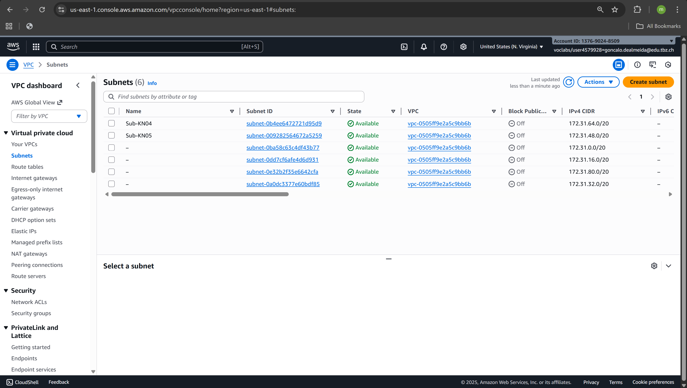

---

### IP-Planung für KN05

Für die beiden Instanzen in Sub-KN05 (172.31.48.0/20) wurden folgende private IPs gewählt:

| Instanz | Private IP | Begründung |
|---------|------------|------------|
| **KN05-DB** | 172.31.48.10 | Durch 10 teilbar, im Subnet-Bereich |
| **KN05-Web** | 172.31.48.20 | Durch 10 teilbar, im Subnet-Bereich |

**Bedingungen erfüllt:**
- ✅ Letzte Zahl durch 10 teilbar
- ✅ IPs liegen im korrekten Subnet (172.31.48.0/20)
- ✅ Eindeutige Adressen

---

## B) Objekte und Instanzen erstellen (70%)

### 1. Security Groups

Security Groups fungieren als **virtuelle Firewalls** für EC2-Instanzen und kontrollieren den eingehenden und ausgehenden Datenverkehr.

#### SG-Database

| Eigenschaft | Wert |
|-------------|------|
| **Name** | SG-Database |
| **Beschreibung** | Security Group für Datenbankserver |
| **Inbound Rules** | SSH (22), MySQL/Aurora (3306) |

**Inbound Rules:**

| Type | Protocol | Port | Source | Beschreibung |
|------|----------|------|--------|--------------|
| SSH | TCP | 22 | 0.0.0.0/0 | SSH-Zugriff |
| MySQL/Aurora | TCP | 3306 | 172.31.0.0/16 | **Nur internes AWS-Netzwerk** |

**Wichtig:** Port 3306 ist **NICHT** öffentlich erreichbar (nur aus dem VPC-Bereich 172.31.0.0/16)!

#### SG-Webserver

| Eigenschaft | Wert |
|-------------|------|
| **Name** | SG-Webserver |
| **Beschreibung** | Security Group für Webserver |
| **Inbound Rules** | SSH (22), HTTP (80) |

**Inbound Rules:**

| Type | Protocol | Port | Source | Beschreibung |
|------|----------|------|--------|--------------|
| SSH | TCP | 22 | 0.0.0.0/0 | SSH-Zugriff |
| HTTP | TCP | 80 | 0.0.0.0/0 | Webserver öffentlich erreichbar |

#### Screenshots: Security Groups

##### Security Groups Liste
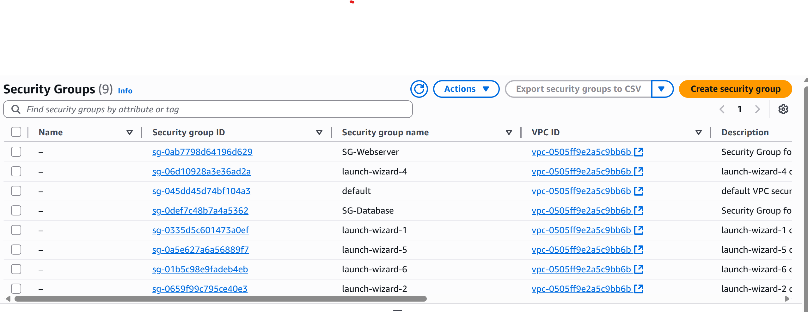

##### SG-Database Inbound Rules
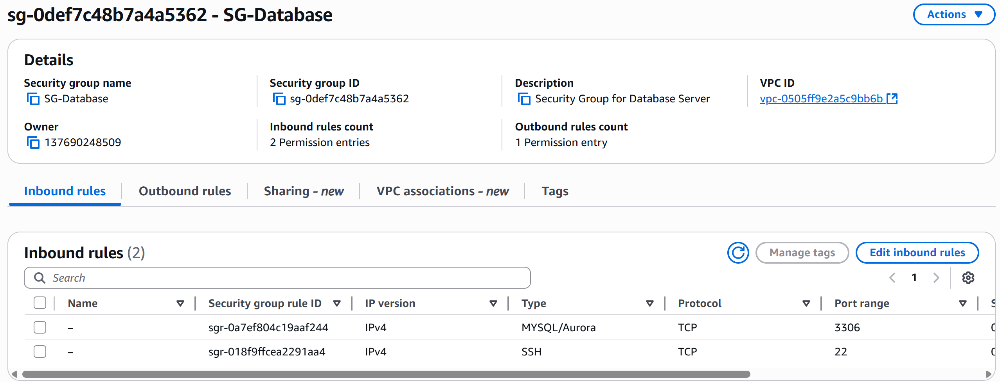

##### SG-Webserver Inbound Rules
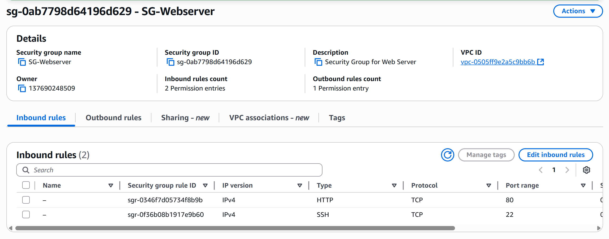

---

### 2. Elastic IP (Statische IP)

Eine Elastic IP wurde für den Webserver erstellt, um eine konstante öffentliche IP-Adresse zu garantieren.

| Eigenschaft | Wert |
|-------------|------|
| **Name** | IP-Web |
| **Elastic IP** | 3.90.117.3 |
| **Zugewiesen an** | KN05-Web |

**Vorteil:** Diese IP bleibt auch nach Stop/Start der Instanz gleich.

#### Screenshot: Elastic IP
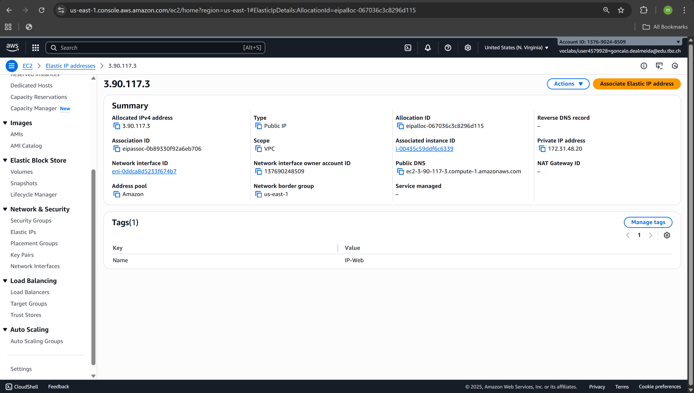

---

### 3. Instanzen erstellen

#### KN05-DB (Datenbank-Server)

| Eigenschaft | Wert |
|-------------|------|
| **Name** | KN05-DB |
| **Instance Type** | t3.micro |
| **OS** | Ubuntu 24.04 LTS |
| **Private IP** | 172.31.48.10 (manuell gesetzt) |
| **Public IP** | 100.25.31.167 (dynamisch) |
| **Subnet** | Sub-KN05 |
| **Security Group** | SG-Database |
| **Ports** | SSH (22), MySQL (3306) - nur intern |

#### Cloud-init Konfiguration: KN05-DB

Die vollständige Datei: [`cloud-init-kn05-db.yaml`](./cloud-init-kn05-db.yaml)

```yaml
#cloud-config
users:
  - name: ubuntu
    sudo: ALL=(ALL) NOPASSWD:ALL
    groups: users, admin
    shell: /bin/bash
    ssh_authorized_keys:
      - ssh-rsa AAAAB3NzaC1yc2EAAAADAQABAAABAQDEt1OjtorQ8NSEJp/u1XCESB3+sayt9CqEZmrFwjM2wRvtN9xY9knpySmKnbshpeGto15h5kVDc1fkqxIG7GUqP27V441bql+YOmiD/yQjwhXt23d6H9CqWEm+LrDx0J54A0EHaKs4gAG1g2cq4/f8u7+MJMI6lLjdeGdB9q31MsxhH4dLaCo1N+QLeQSdrAmDQNwYOMhSNSMRRv+iZpKPCl4xx1CAnA0YqOWHUpYhN+O9JjJJRqEJm0Wsb3J3rmFAvHeGE4CAUq+wd+w3rnzp5ZwZwGNWQDVqzIA0J6uexHF9TnBmeWnt8zl74PL3SP/LAMtw4KE0v56batcI49DP aws-key
      - ssh-rsa AAAAB3NzaC1yc2EAAAADAQABAAABAQC0WGP1EZykEtv5YGC9nMiPFW3U3DmZNzKFO5nEu6uozEHh4jLZzPNHSrfFTuQ2GnRDSt+XbOtTLdcj26+iPNiFoFha42aCIzYjt6V8Z+SQ9pzF4jPPzxwXfDdkEWylgoNnZ+4MG1lNFqa8aO7F62tX0Yj5khjC0Bs7Mb2cHLx1XZaxJV6qSaulDuBbLYe8QUZXkMc7wmob3PM0kflfolR3LE7LResIHWa4j4FL6r5cQmFlDU2BDPpKMFMGUfRSFiUtaWBNXFOWHQBC2+uKmuMPYP4vJC9sBgqMvPN/X2KyemqdMvdKXnCfrzadHuSSJYEzD64Cve5Zl9yVvY4AqyBD teacher-key

ssh_pwauth: false
disable_root: false

package_update: true
packages:
  - mariadb-server

runcmd:
  - sudo mysql -sfu root -e "GRANT ALL ON *.* TO 'admin'@'%' IDENTIFIED BY 'admin' WITH GRANT OPTION;"
  - sudo sed -i 's/127.0.0.1/0.0.0.0/g' /etc/mysql/mariadb.conf.d/50-server.cnf
  - sudo systemctl restart mariadb.service
```

#### Screenshot: KN05-DB Details
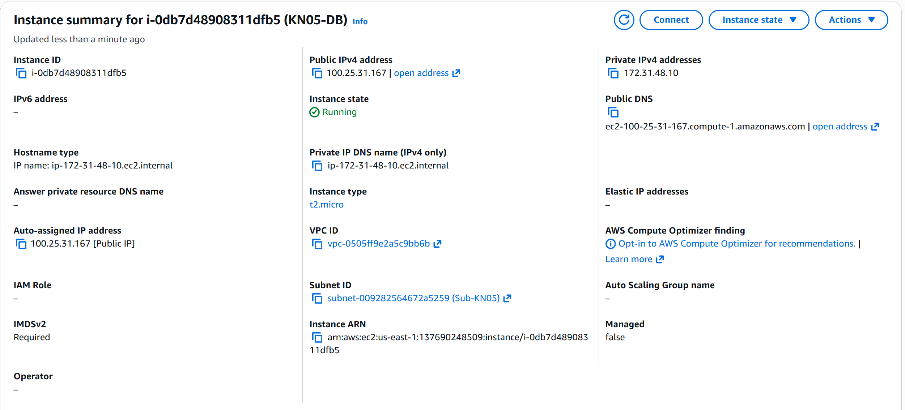

Zeigt Subnet ID und Private IP (172.31.48.10).

---

#### KN05-Web (Webserver)

| Eigenschaft | Wert |
|-------------|------|
| **Name** | KN05-Web |
| **Instance Type** | t3.micro |
| **OS** | Ubuntu 24.04 LTS |
| **Private IP** | 172.31.48.20 (manuell gesetzt) |
| **Elastic IP** | 3.90.117.3 (statisch) |
| **Subnet** | Sub-KN05 |
| **Security Group** | SG-Webserver |
| **Ports** | SSH (22), HTTP (80) |

#### Cloud-init Konfiguration: KN05-Web

Die vollständige Datei: [`cloud-init-kn05-web.yaml`](./cloud-init-kn05-web.yaml)

```yaml
#cloud-config
users:
  - name: ubuntu
    sudo: ALL=(ALL) NOPASSWD:ALL
    groups: users, admin
    shell: /bin/bash
    ssh_authorized_keys:
      - ssh-rsa AAAAB3NzaC1yc2EAAAADAQABAAABAQDEt1OjtorQ8NSEJp/u1XCESB3+sayt9CqEZmrFwjM2wRvtN9xY9knpySmKnbshpeGto15h5kVDc1fkqxIG7GUqP27V441bql+YOmiD/yQjwhXt23d6H9CqWEm+LrDx0J54A0EHaKs4gAG1g2cq4/f8u7+MJMI6lLjdeGdB9q31MsxhH4dLaCo1N+QLeQSdrAmDQNwYOMhSNSMRRv+iZpKPCl4xx1CAnA0YqOWHUpYhN+O9JjJJRqEJm0Wsb3J3rmFAvHeGE4CAUq+wd+w3rnzp5ZwZwGNWQDVqzIA0J6uexHF9TnBmeWnt8zl74PL3SP/LAMtw4KE0v56batcI49DP aws-key
      - ssh-rsa AAAAB3NzaC1yc2EAAAADAQABAAABAQC0WGP1EZykEtv5YGC9nMiPFW3U3DmZNzKFO5nEu6uozEHh4jLZzPNHSrfFTuQ2GnRDSt+XbOtTLdcj26+iPNiFoFha42aCIzYjt6V8Z+SQ9pzF4jPPzxwXfDdkEWylgoNnZ+4MG1lNFqa8aO7F62tX0Yj5khjC0Bs7Mb2cHLx1XZaxJV6qSaulDuBbLYe8QUZXkMc7wmob3PM0kflfolR3LE7LResIHWa4j4FL6r5cQmFlDU2BDPpKMFMGUfRSFiUtaWBNXFOWHQBC2+uKmuMPYP4vJC9sBgqMvPN/X2KyemqdMvdKXnCfrzadHuSSJYEzD64Cve5Zl9yVvY4AqyBD teacher-key

ssh_pwauth: false
disable_root: false

package_update: true
packages:
  - apache2
  - php
  - libapache2-mod-php
  - php-mysql
  - adminer

write_files:
  - path: /var/www/html/info.php
    content: |
      <?php
      phpinfo();
      ?>

  - path: /var/www/html/db.php
    content: |
      <?php
      $servername = "172.31.48.10";
      $username = "admin";
      $password = "admin";
      $dbname = "mysql";

      $conn = new mysqli($servername, $username, $password, $dbname);

      if ($conn->connect_error) {
          die("Connection failed: " . $conn->connect_error);
      }

      echo "<h1>Database Connection Successful!</h1>";
      echo "<p>Connected to database on " . $servername . "</p>";

      $sql = "SELECT User, Host FROM mysql.user";
      $result = $conn->query($sql);

      if ($result->num_rows > 0) {
          echo "<table border='1'><tr><th>User</th><th>Host</th></tr>";
          while($row = $result->fetch_assoc()) {
              echo "<tr><td>" . $row["User"]. "</td><td>" . $row["Host"]. "</td></tr>";
          }
          echo "</table>";
      }
      $conn->close();
      ?>

runcmd:
  - sudo a2enconf adminer
  - sudo systemctl restart apache2
```

**Wichtig:** Der Webserver verbindet sich zur Datenbank über die **Private IP 172.31.48.10** (nicht über Public IP).

#### Screenshot: KN05-Web Details
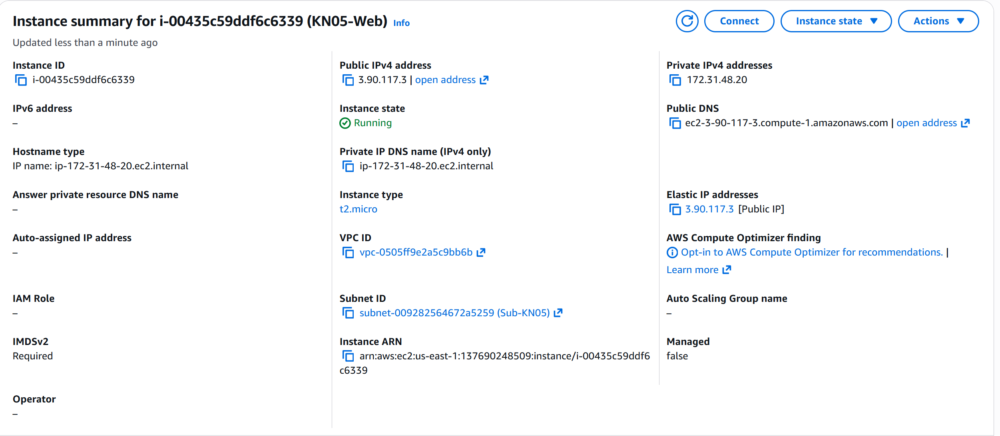

Zeigt Subnet ID, Private IP (172.31.48.20) und Elastic IP (3.90.117.3).

---

### 4. Stop/Start Test - IP-Persistenz

Um zu beweisen, dass die konfigurierten IPs persistent sind, wurden beide Instanzen gestoppt und wieder gestartet.

#### Instanzen im gestoppten Zustand

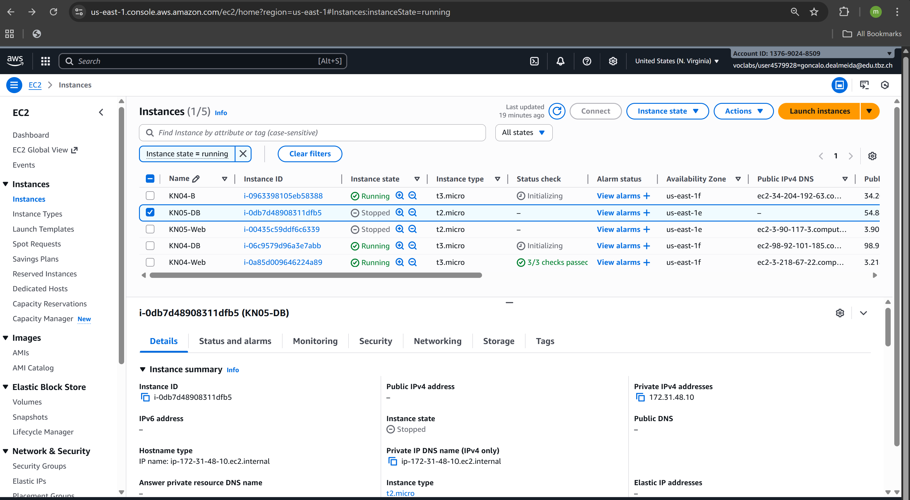

**Sichtbare IPs im gestoppten Zustand:**
- KN05-DB: Private IP 172.31.48.10
- KN05-Web: Private IP 172.31.48.20, Elastic IP 3.90.117.3

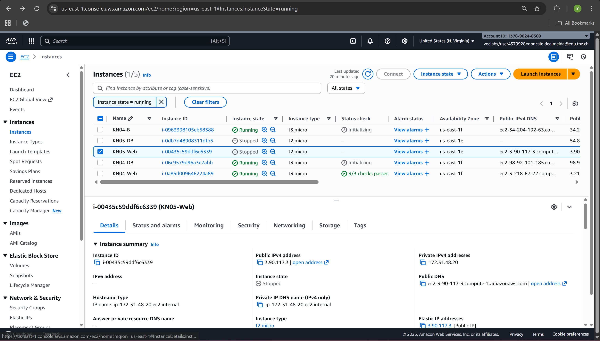

#### Instanzen nach dem Neustart

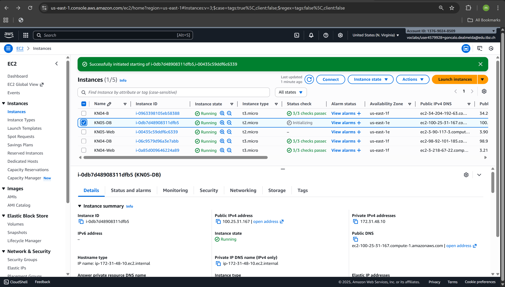

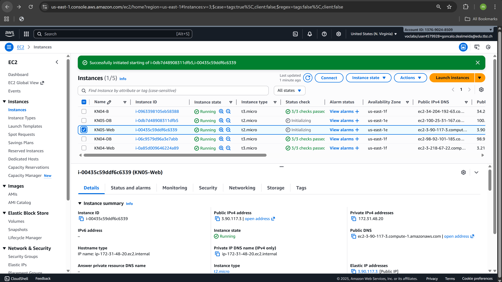

**Ergebnis nach Neustart:**

| Instanz | Private IP | Public IP | Status |
|---------|------------|-----------|--------|
| KN05-DB | 172.31.48.10 | 100.25.31.167 | ✅ Gleich geblieben |
| KN05-Web | 172.31.48.20 | 3.90.117.3 | ✅ Gleich geblieben |

**Fazit:**
- ✅ Private IPs bleiben immer gleich (AWS-Garantie)
- ✅ Elastic IP bleibt gleich (statische IP)
- ✅ Public IP vom DB-Server könnte sich ändern (aber irrelevant, da nur Private IP verwendet wird)

---

### 5. Webseiten-Tests

Nach der erfolgreichen Konfiguration wurden alle Webseiten getestet.

#### index.html - Apache Default Page

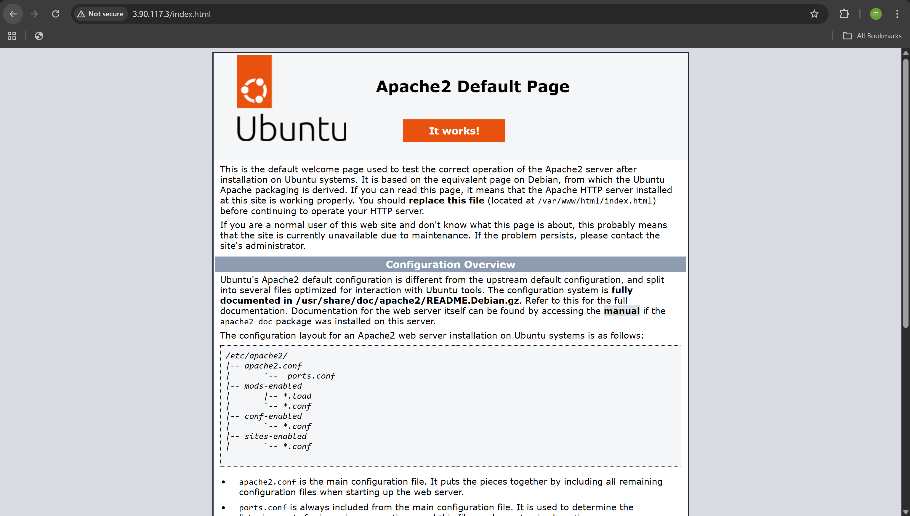

**URL:** `http://3.90.117.3/index.html`

**Ergebnis:** ✅ Apache läuft erfolgreich

---

#### info.php - PHP Info

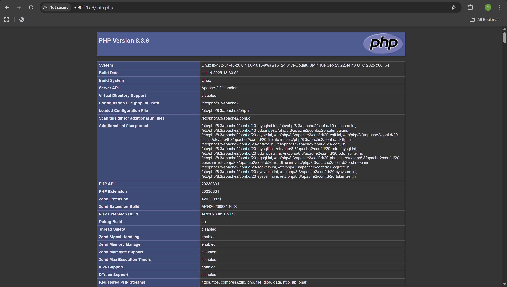

**URL:** `http://3.90.117.3/info.php`

**Ergebnis:** ✅ PHP ist installiert und funktioniert

---

#### db.php - Datenbankverbindung

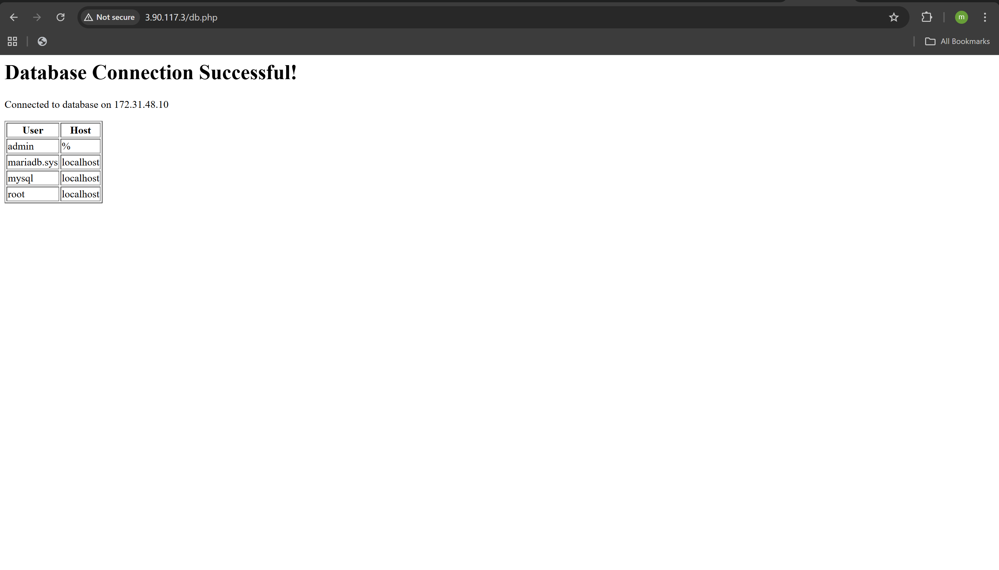

**URL:** `http://3.90.117.3/db.php`

**Ergebnis:**
- ✅ "Database Connection Successful!"
- ✅ "Connected to database on 172.31.48.10"
- ✅ Tabelle mit MySQL-Benutzern wird angezeigt

Dies beweist:
1. Webserver kann Datenbankserver über Private IP erreichen
2. Security Group erlaubt Kommunikation auf Port 3306
3. MariaDB ist korrekt konfiguriert (bind-address = 0.0.0.0)

---

## Architektur-Diagramm

```
┌─────────────────────────────────────────────────────────────┐
│                         Internet                            │
└─────────────────────────────────────────────────────────────┘
                              │
                              │ HTTP (Port 80)
                              ▼
                    ┌──────────────────────┐
                    │    KN05-Web          │
                    │  Elastic IP:         │
                    │  3.90.117.3          │
                    │  Private IP:         │
                    │  172.31.48.20        │
                    │  SG: SG-Webserver    │
                    └──────────────────────┘
                              │
                              │ MySQL (Port 3306)
                              │ Private Network
                              ▼
                    ┌──────────────────────┐
                    │    KN05-DB           │
                    │  Public IP:          │
                    │  100.25.31.167       │
                    │  Private IP:         │
                    │  172.31.48.10        │
                    │  SG: SG-Database     │
                    │  (3306: nur intern!) │
                    └──────────────────────┘

        Beide Instanzen im Subnet: Sub-KN05 (172.31.48.0/20)
```

---

## Erkenntnisse

### Netzwerk-Sicherheit

1. **Private IPs für interne Kommunikation:** Web-Server verwendet ausschließlich die Private IP (172.31.48.10) des DB-Servers
2. **Security Groups als Firewall:**
   - DB-Server: MySQL-Port nur für VPC-interne Verbindungen geöffnet
   - Web-Server: HTTP-Port öffentlich, aber nur notwendige Ports geöffnet
3. **Elastic IP für Stabilität:** Webserver hat konstante öffentliche IP für DNS/externe Clients

### IP-Management

1. **Private IPs:** Werden bei Instanz-Erstellung fest zugewiesen und ändern sich nie
2. **Elastic IPs:** Müssen explizit erstellt und zugewiesen werden
3. **Dynamische Public IPs:** Können sich bei Stop/Start ändern (daher Elastic IP für wichtige Services)

### Cloud-init Integration

1. Die Netzwerk-Konfiguration (Subnet, IPs, Security Groups) wird in AWS-GUI gesetzt
2. Cloud-init konfiguriert das Betriebssystem und installiert Software
3. Kombination beider Tools ermöglicht vollständige Automatisierung

---

## Zusammenfassung

| Teil | Beschreibung | Status |
|------|--------------|--------|
| A | Netzwerk-Grundbegriffe erklärt, Subnets analysiert, IPs geplant | ✅ |
| B | Security Groups erstellt, Elastic IP konfiguriert | ✅ |
| B | Instanzen mit festen Private IPs erstellt | ✅ |
| B | IP-Persistenz nach Stop/Start bewiesen | ✅ |
| B | Alle Webseiten funktionieren (index.html, info.php, db.php) | ✅ |

**Ergebnis:** Eine vollständig funktionierende, sicher konfigurierte Zwei-Server-Architektur mit statischen IPs und korrekten Netzwerk-Einstellungen.
