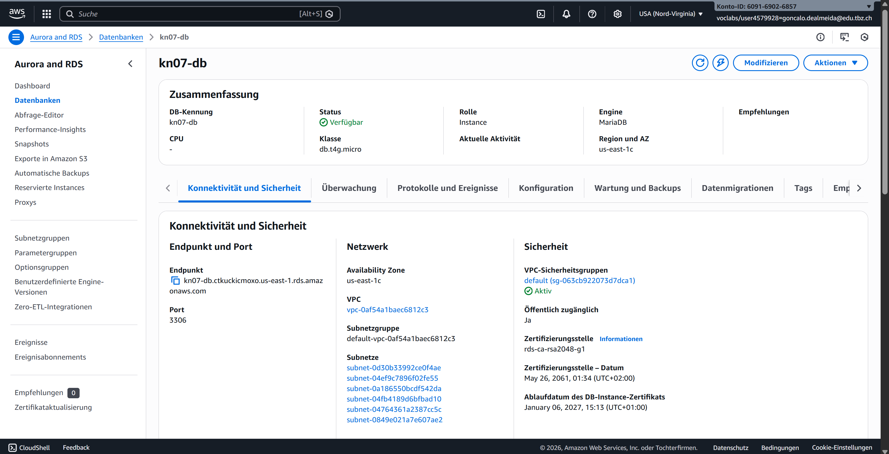
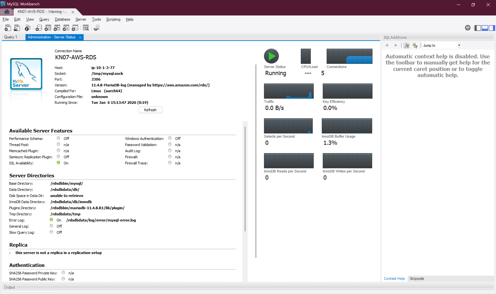
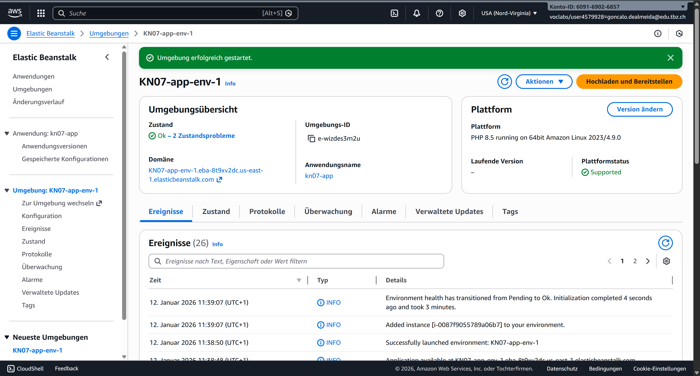
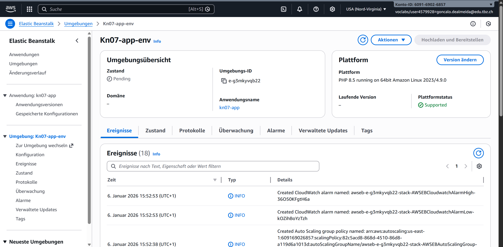
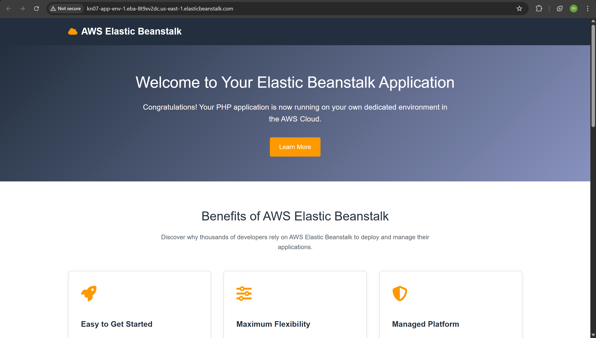
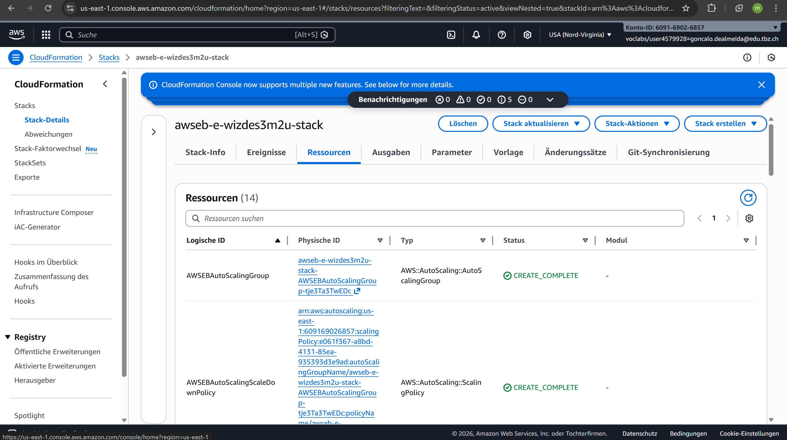
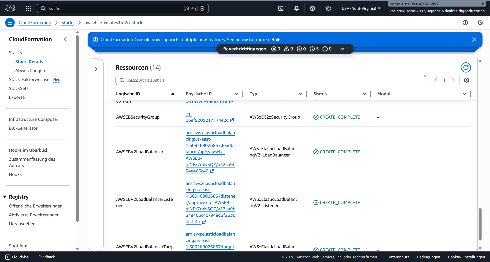
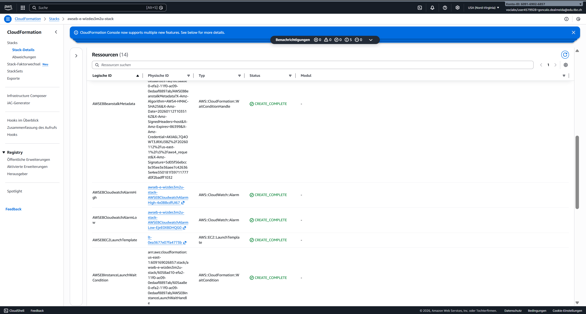

# KN07: PAAS

## A) Datenbank im PAAS Modell (20%)

### RDS Datenbank erstellt

**Konfiguration:**
| Einstellung | Wert |
|-------------|------|
| Engine | MariaDB |
| Instance-Klasse | db.t4g.micro |
| Storage | 20 GB |
| Öffentlicher Zugriff | Ja |
| Region | us-east-1 |
| Endpoint | kn07-db.ctkuckicmoxo.us-east-1.rds.amazonaws.com |
| Port | 3306 |

### MySQL Workbench Verbindung

Die Verbindung zur RDS-Datenbank wurde erfolgreich hergestellt und ein Test-Query ausgeführt.

### Erklärung: Warum PAAS/SAAS statt eigene Datenbank?

**Vorteile von PAAS (RDS) gegenüber selbst installierter Datenbank:**

1. **Kein Server-Management**: AWS übernimmt OS-Updates, Patches und Wartung
2. **Automatische Backups**: Tägliche Snapshots ohne eigene Konfiguration
3. **Hohe Verfügbarkeit**: Multi-AZ Option für Failover
4. **Skalierbarkeit**: Instance-Grösse kann einfach angepasst werden
5. **Sicherheit**: Verschlüsselung, Security Groups, IAM Integration
6. **Monitoring**: CloudWatch Metriken automatisch verfügbar

**Nachteile von selbst installierter Datenbank (IAAS):**
- Eigene Backups konfigurieren und testen
- OS und DB-Software selbst updaten
- Keine automatische Wiederherstellung bei Ausfall
- Mehr Personalaufwand für Administration

---

## B) PAAS Applikation erstellen (60%)

### Elastic Beanstalk Umgebung

**Umgebungskonfiguration:**
| Einstellung | Wert |
|-------------|------|
| Anwendungsname | KN07-app |
| Umgebungsname | KN07-app-env-1 |
| Plattform | PHP 8.5 on Amazon Linux 2023 |
| Umgebungstyp | Mit Load Balancer (Hohe Verfügbarkeit) |
| Instance-Typ | t2.small |
| Min/Max Instances | 1 / 4 |

### Laufende Applikation

Die Beispielanwendung ist über die Elastic Beanstalk Domain erreichbar.

### Elastic Beanstalk Web Interface

Übersicht der Elastic Beanstalk Konfiguration im AWS Web Interface.

---

## C) Erstellte Ressourcen/Objekte und CloudFormation (20%)

### Was ist CloudFormation?

**CloudFormation** ist ein AWS Service für Infrastructure as Code (IaC). Er ermöglicht:
- Definition von AWS-Ressourcen in Templates (YAML/JSON)
- Automatische Erstellung und Verwaltung von Ressourcen als "Stack"
- Versionierung und Wiederholbarkeit der Infrastruktur
- Abhängigkeiten zwischen Ressourcen werden automatisch verwaltet

### Unterschied CloudFormation vs. Cloud-Init

| Aspekt | CloudFormation | Cloud-Init |
|--------|----------------|------------|
| **Scope** | Gesamte AWS-Infrastruktur | Einzelne EC2-Instance |
| **Was wird erstellt?** | VPCs, EC2, RDS, S3, Load Balancer, etc. | Software, Konfiguration auf einer Instance |
| **Wann läuft es?** | Beim Stack-Erstellen | Beim ersten Boot der Instance |
| **Sprache** | YAML/JSON Templates | Shell-Scripts, YAML |
| **Beispiel** | Erstellt 3 EC2 + Load Balancer + RDS | Installiert Apache, PHP auf einer EC2 |

**Zusammenfassung:**
- **CloudFormation** = Erstellt die Infrastruktur (Server, Netzwerk, Datenbanken)
- **Cloud-Init** = Konfiguriert eine einzelne Instance (Software installieren, Dateien erstellen)

### CloudFormation Ressourcen für Elastic Beanstalk

**Automatisch erstellte Ressourcen:**

| Ressource | Typ | Beschreibung |
|-----------|-----|--------------|
| AWSEBAutoScalingGroup | Auto Scaling Group | Verwaltet EC2 Instances |
| AWSEBAutoScalingScaleUpPolicy | Scaling Policy | Skaliert nach oben |
| AWSEBAutoScalingScaleDownPolicy | Scaling Policy | Skaliert nach unten |
| AWSEBCloudwatchAlarmHigh | CloudWatch Alarm | Alarm bei hoher Last |
| AWSEBCloudwatchAlarmLow | CloudWatch Alarm | Alarm bei niedriger Last |
| AWSEBV2LoadBalancer | Application Load Balancer | Verteilt Traffic |
| AWSEBV2LoadBalancerTargetGroup | Target Group | Ziel für Load Balancer |
| AWSEBV2LoadBalancerListener | Listener | HTTP Port 80 |
| AWSEBSecurityGroup | Security Group | Firewall-Regeln |
| AWSEBAutoScalingLaunchConfiguration | Launch Config | Template für neue Instances |

### Vergleich mit KN06 (IAAS)

| Aspekt | KN06 (IAAS) | KN07 (PAAS) |
|--------|-------------|-------------|
| EC2 erstellen | Manuell | Automatisch durch EB |
| Load Balancer | Manuell konfigurieren | Automatisch erstellt |
| Auto Scaling | Manuell einrichten | Automatisch konfiguriert |
| Security Groups | Manuell erstellen | Automatisch generiert |
| Deployment | SSH + manuelle Installation | Upload ZIP oder Git |
| Monitoring | Manuell CloudWatch einrichten | Automatisch aktiviert |
| Updates | Selbst verwalten | Verwaltete Updates möglich |

**Fazit:** PAAS (Elastic Beanstalk) nimmt dem Entwickler die gesamte Infrastruktur-Arbeit ab. Man muss nur den Code deployen - alles andere wird automatisch erstellt und verwaltet.
