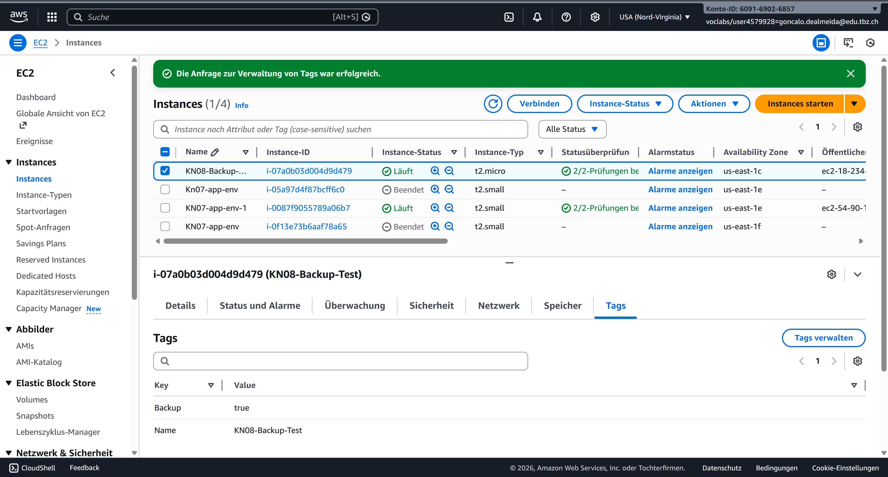
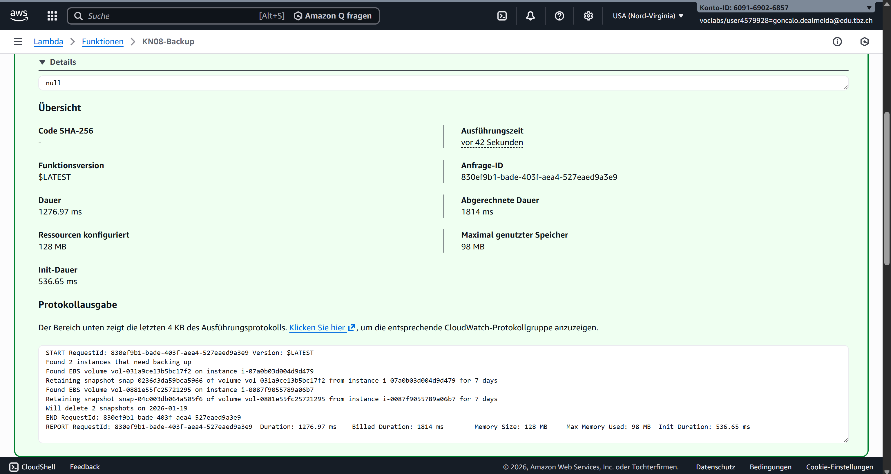
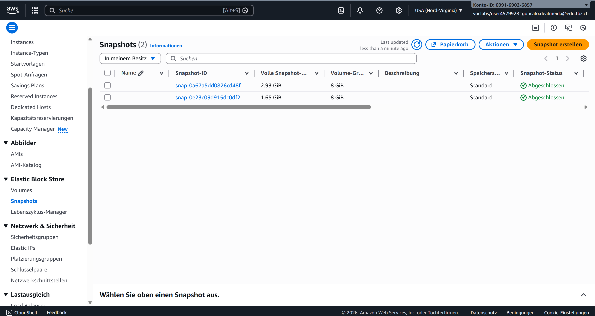
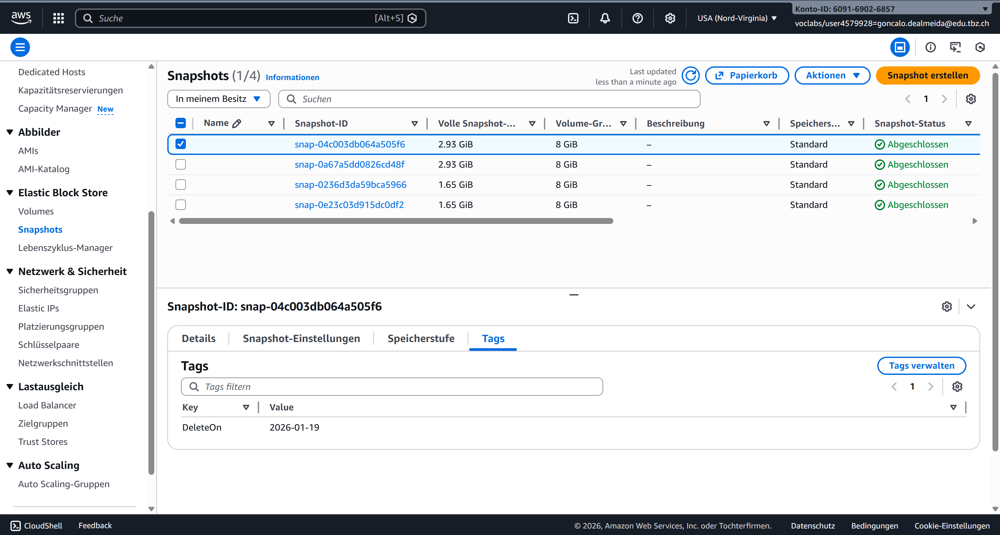
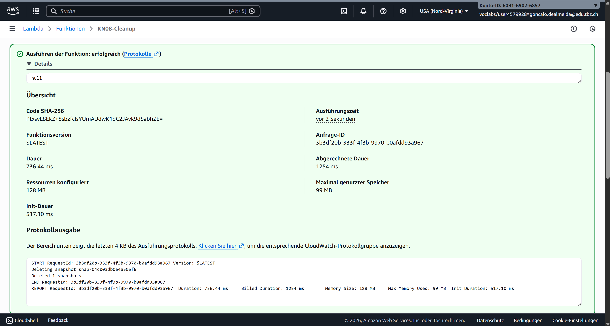
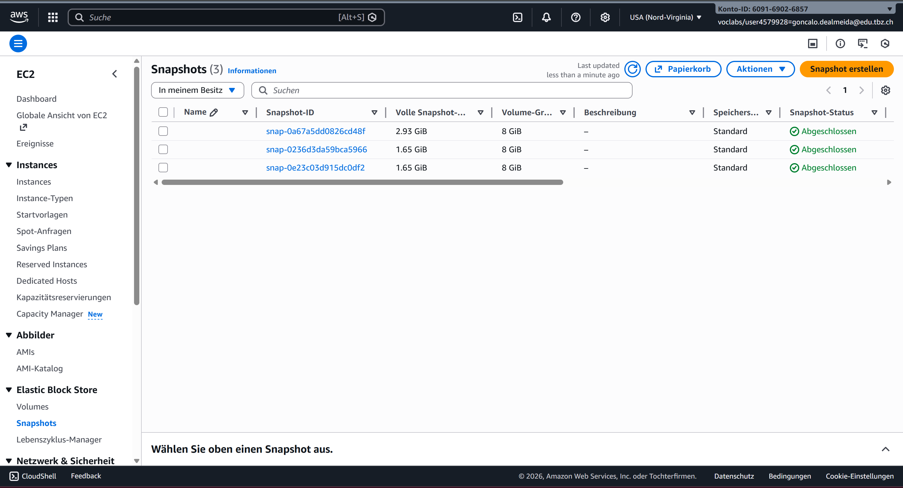
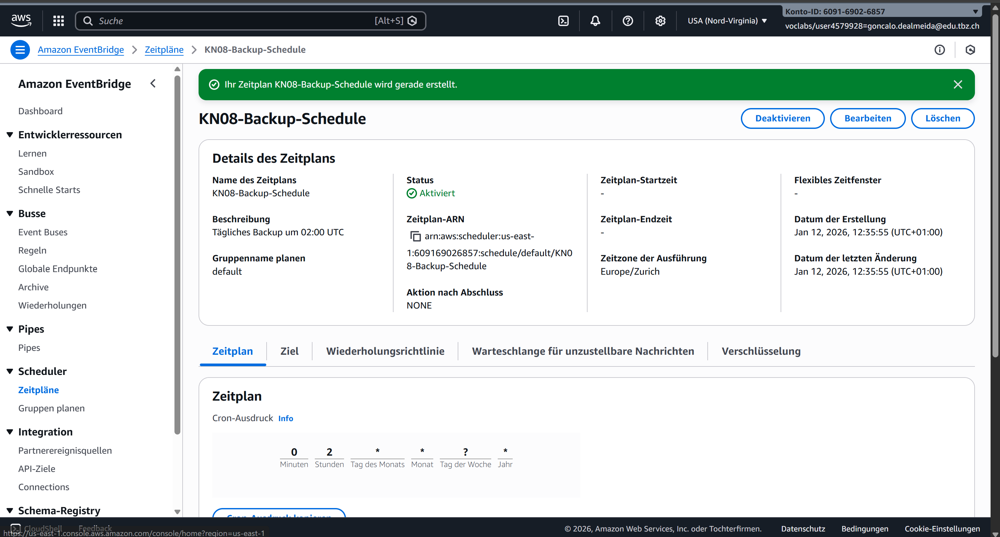

# KN08: FaaS und Backup

## Übersicht

In dieser Kompetenz arbeiten wir mit **Serverless Funktionen (FaaS)** und setzen praktische Wartungsarbeit (Backups) um.

| Teil | Aufgabe | Gewichtung |
|------|---------|------------|
| A | Backup- und Cleanup-Skript mit Lambda | 70% |
| B | CRON-Job für Automatisierung | 30% |

---

## A) Backup-Skript (70%)

### EC2 Instanzen mit Backup-Tag



**Konfiguration:**
- 2 EC2 Instanzen wurden mit dem Tag `Backup = true` versehen
- Das Backup-Skript sucht nach allen Instanzen mit diesem Tag

### Lambda Funktion: KN08-Backup

**Konfiguration:**
| Einstellung | Wert |
|-------------|------|
| Funktionsname | KN08-Backup |
| Laufzeit | Python 3.13 |
| Ausführungsrolle | LabRole |
| Timeout | 3 Sekunden (Standard) |

**Code (backup.py):**
```python
import boto3
import collections
import datetime

ec = boto3.client('ec2')

def lambda_handler(event, context):
    reservations = ec.describe_instances(
        Filters=[
            {'Name': 'tag-key', 'Values': ['backup', 'Backup']},
        ]
    ).get(
        'Reservations', []
    )

    instances = sum(
        [
            [i for i in r['Instances']]
            for r in reservations
        ], [])

    print('Found %d instances that need backing up' % len(instances))

    to_tag = collections.defaultdict(list)

    for instance in instances:
        try:
            retention_days = [
                int(t.get('Value')) for t in instance['Tags']
                if t['Key'] == 'Retention'][0]
        except IndexError:
            retention_days = 7

        for dev in instance['BlockDeviceMappings']:
            if dev.get('Ebs', None) is None:
                continue
            vol_id = dev['Ebs']['VolumeId']
            print("Found EBS volume %s on instance %s" % (vol_id, instance['InstanceId']))

            snap = ec.create_snapshot(
                VolumeId=vol_id,
            )

            to_tag[retention_days].append(snap['SnapshotId'])

            print("Retaining snapshot %s of volume %s from instance %s for %d days" % (
                snap['SnapshotId'],
                vol_id,
                instance['InstanceId'],
                retention_days,
            ))

    for retention_days in to_tag.keys():
        delete_date = datetime.date.today() + datetime.timedelta(days=retention_days)
        delete_fmt = delete_date.strftime('%Y-%m-%d')
        print("Will delete %d snapshots on %s" % (len(to_tag[retention_days]), delete_fmt))

        ec.create_tags(
            Resources=to_tag[retention_days],
            Tags=[
                {'Key': 'DeleteOn', 'Value': delete_fmt},
            ]
        )
```

**Funktionsweise:**
1. Sucht alle EC2 Instanzen mit Tag `Backup`
2. Erstellt Snapshots der EBS-Volumes
3. Fügt Tag `DeleteOn` mit Datum (heute + 7 Tage) hinzu

### Lambda Test erfolgreich



Die Lambda-Funktion wurde erfolgreich ausgeführt und hat Snapshots erstellt.

### Liste der erstellten Snapshots



Die Snapshots wurden für beide EC2 Instanzen erstellt.

### Tags eines Snapshots



Jeder Snapshot hat den Tag `DeleteOn` mit dem Löschdatum (7 Tage in der Zukunft).

---

### Lambda Funktion: KN08-Cleanup

**Konfiguration:**
| Einstellung | Wert |
|-------------|------|
| Funktionsname | KN08-Cleanup |
| Laufzeit | Python 3.13 |
| Ausführungsrolle | LabRole |

**Code (cleanup.py):**
```python
import boto3
import datetime

ec = boto3.client('ec2')

def lambda_handler(event, context):
    account_ids = ['609169026857']

    delete_on = datetime.date.today().strftime('%Y-%m-%d')
    filters = [
        {'Name': 'tag-key', 'Values': ['DeleteOn']},
        {'Name': 'tag-value', 'Values': [delete_on]},
    ]
    snapshot_response = ec.describe_snapshots(OwnerIds=account_ids, Filters=filters)

    for snap in snapshot_response['Snapshots']:
        print("Deleting snapshot %s" % snap['SnapshotId'])
        ec.delete_snapshot(SnapshotId=snap['SnapshotId'])

    print("Deleted %d snapshots" % len(snapshot_response['Snapshots']))
```

**Funktionsweise:**
1. Sucht alle Snapshots mit Tag `DeleteOn` = heutiges Datum
2. Löscht diese Snapshots automatisch

### Cleanup Test

Um das Cleanup zu testen, wurde bei einem Snapshot das `DeleteOn`-Datum auf das heutige Datum geändert.



### Snapshots nach Cleanup



Nach dem Cleanup wurde der Snapshot mit dem heutigen Löschdatum entfernt. Der andere Snapshot (mit zukünftigem Datum) bleibt erhalten.

---

## B) CRON-Job (30%)

### Automatisierung mit Amazon EventBridge Scheduler

Um die Backup-Funktion automatisch auszuführen, wurde ein EventBridge Zeitplan erstellt.



**Konfiguration:**
| Einstellung | Wert |
|-------------|------|
| Name | KN08-Backup-Schedule |
| Zeitplan | Cron: `0 2 * * ? *` |
| Ausführung | Täglich um 02:00 UTC |
| Ziel | Lambda: KN08-Backup |
| Ausführungsrolle | LabRole |
| Status | Aktiviert |

### Cron-Ausdruck erklärt

```
cron(0 2 * * ? *)
      │ │ │ │ │ │
      │ │ │ │ │ └── Jahr: * (jedes Jahr)
      │ │ │ │ └──── Wochentag: ? (beliebig)
      │ │ │ └────── Monat: * (jeden Monat)
      │ │ └──────── Tag: * (jeden Tag)
      │ └────────── Stunde: 2 (02:00 Uhr)
      └──────────── Minute: 0
```

### Zwei Wege zur Automatisierung

Es gibt zwei Möglichkeiten, Lambda-Funktionen automatisch auszuführen:

| Methode | Service | Beschreibung |
|---------|---------|--------------|
| **EventBridge Scheduler** | Amazon EventBridge | Zeitpläne mit Cron-Ausdrücken, flexibel und mächtig |
| **EventBridge Rules** | Amazon EventBridge | Event-basierte Auslöser, reagiert auf AWS-Events |

Für regelmässige Backups ist der **EventBridge Scheduler** die bessere Wahl, da er speziell für zeitbasierte Aufgaben entwickelt wurde.

---

## Zusammenfassung

### Was ist FaaS (Function as a Service)?

**FaaS** ist ein Serverless-Modell, bei dem:
- Code in Funktionen ausgeführt wird
- Keine Server verwaltet werden müssen
- Bezahlung nur für die tatsächliche Ausführungszeit
- Automatische Skalierung

**AWS Lambda** ist der FaaS-Service von AWS.

### Vorteile von Lambda für Backup-Aufgaben

| Vorteil | Beschreibung |
|---------|--------------|
| **Kosteneffizient** | Bezahlung nur bei Ausführung (nicht 24/7) |
| **Kein Server** | Keine EC2-Instanz für Backup-Scripts nötig |
| **Automatisierung** | Einfache Integration mit EventBridge |
| **Skalierbar** | Kann viele Backups parallel erstellen |
| **Zuverlässig** | AWS garantiert hohe Verfügbarkeit |

### Gelernte Konzepte

1. **Lambda-Funktionen** erstellen und testen
2. **IAM-Rollen** für Lambda-Berechtigungen
3. **boto3** SDK für AWS-Operationen in Python
4. **EBS Snapshots** als Backup-Methode
5. **Tags** zur Organisation und Automatisierung
6. **EventBridge Scheduler** für CRON-Jobs
