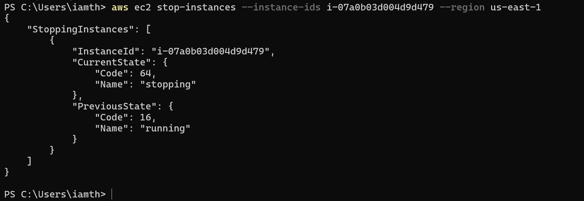
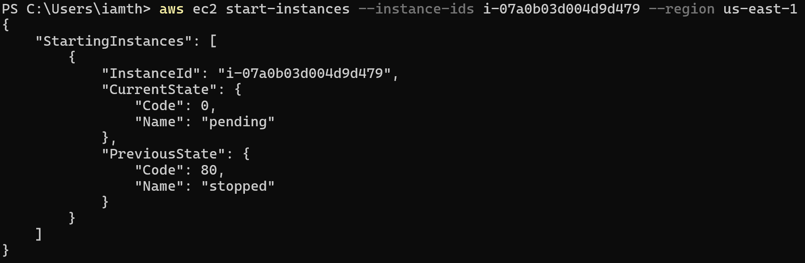
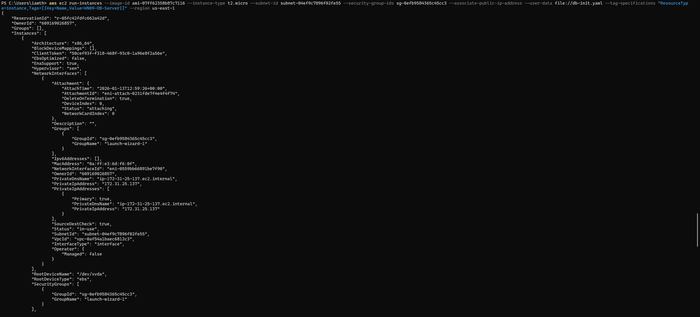
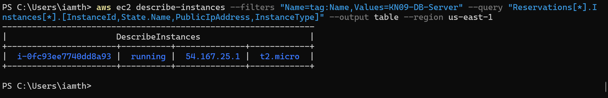
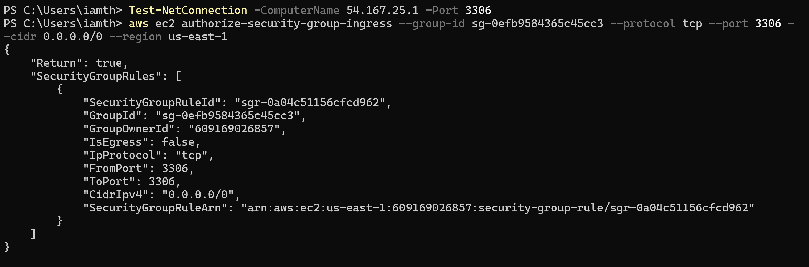
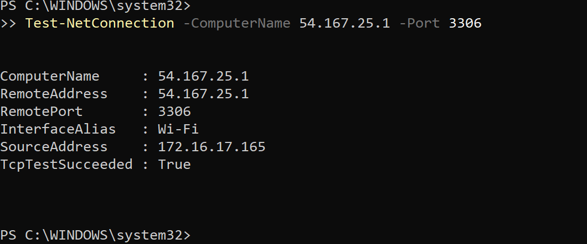
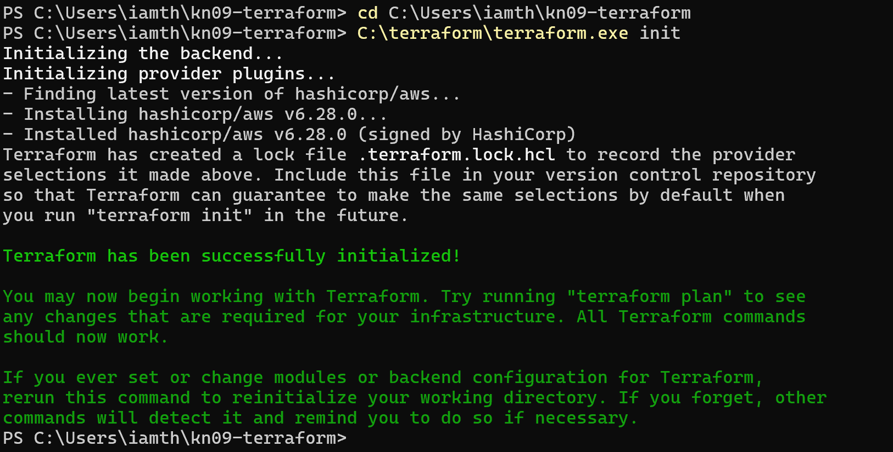
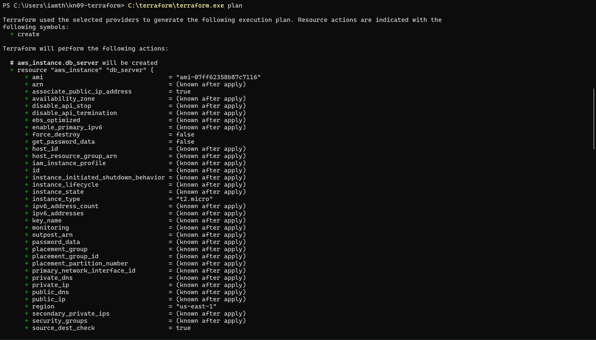
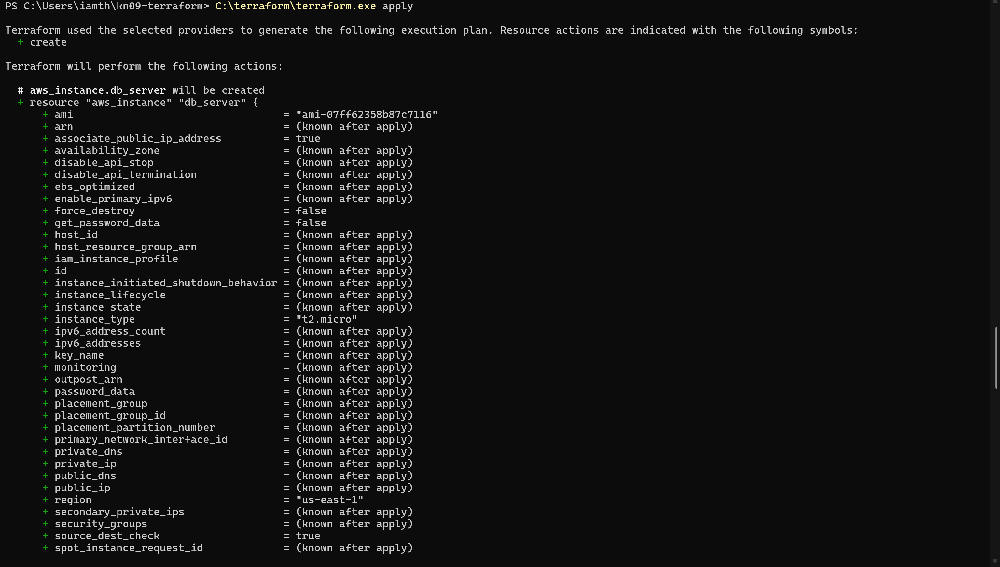
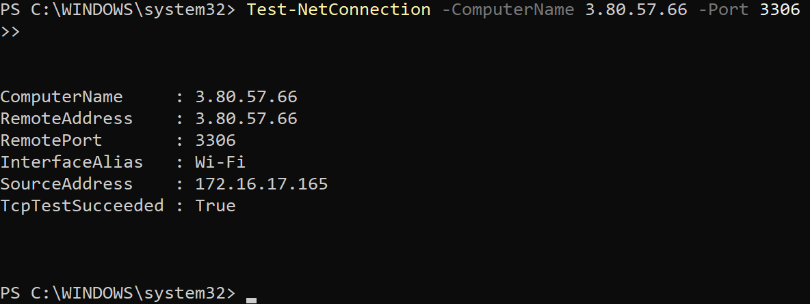

# KN09: Automation

## Übersicht

| Teil | Aufgabe | Gewichtung |
|------|---------|------------|
| A | AWS CLI | 30% |
| B | Terraform | 70% |

---

## A) Automatisierung mit Command Line Interface (CLI) (30%)

### AWS CLI Installation und Konfiguration

AWS CLI wurde installiert und mit den Credentials aus dem AWS Academy Lab konfiguriert.

```bash
aws --version
# aws-cli/2.x.x Python/3.x.x Windows/10
```

### Instanz stoppen



```bash
aws ec2 stop-instances --instance-ids i-07a0b03d004d9d479 --region us-east-1
```

**Ergebnis:** Die Instanz wechselt von `running` zu `stopping` zu `stopped`.

### Instanz starten



```bash
aws ec2 start-instances --instance-ids i-07a0b03d004d9d479 --region us-east-1
```

**Ergebnis:** Die Instanz wechselt von `stopped` zu `pending` zu `running`.

### Neue Instanz erstellen (Datenbank-Server)



```bash
aws ec2 run-instances \
  --image-id ami-07ff62358b87c7116 \
  --instance-type t2.micro \
  --subnet-id subnet-04ef9c7896f02fe55 \
  --security-group-ids sg-0efb9584365c45cc3 \
  --associate-public-ip-address \
  --user-data file://db-init.yaml \
  --tag-specifications "ResourceType=instance,Tags=[{Key=Name,Value=KN09-DB-Server}]" \
  --region us-east-1
```

### Details der erstellten Instanz



```bash
aws ec2 describe-instances \
  --filters "Name=tag:Name,Values=KN09-DB-Server" \
  --query "Reservations[*].Instances[*].[InstanceId,State.Name,PublicIpAddress,InstanceType]" \
  --output table \
  --region us-east-1
```

### Security Group Regel hinzufügen



```bash
aws ec2 authorize-security-group-ingress \
  --group-id sg-0efb9584365c45cc3 \
  --protocol tcp \
  --port 3306 \
  --cidr 0.0.0.0/0 \
  --region us-east-1
```

### Telnet Test (Cloud-Init Überprüfung)



```powershell
Test-NetConnection -ComputerName 54.167.25.1 -Port 3306
```

**Ergebnis:** `TcpTestSucceeded : True` - MariaDB wurde erfolgreich installiert und ist erreichbar.

---

### Konzeptionelle Befehle für KN05

Um die Infrastruktur aus KN05 via CLI nachzubilden, wären folgende Befehle notwendig:

```bash
# 1. VPC erstellen
aws ec2 create-vpc \
  --cidr-block 10.0.0.0/16 \
  --tag-specifications "ResourceType=vpc,Tags=[{Key=Name,Value=KN09-VPC}]"

# 2. Internet Gateway erstellen
aws ec2 create-internet-gateway \
  --tag-specifications "ResourceType=internet-gateway,Tags=[{Key=Name,Value=KN09-IGW}]"

# 3. Internet Gateway an VPC anhängen
aws ec2 attach-internet-gateway \
  --internet-gateway-id igw-xxxxxxxxx \
  --vpc-id vpc-xxxxxxxxx

# 4. Subnet erstellen
aws ec2 create-subnet \
  --vpc-id vpc-xxxxxxxxx \
  --cidr-block 10.0.1.0/24 \
  --availability-zone us-east-1a \
  --tag-specifications "ResourceType=subnet,Tags=[{Key=Name,Value=KN09-Subnet}]"

# 5. Route Table erstellen
aws ec2 create-route-table \
  --vpc-id vpc-xxxxxxxxx \
  --tag-specifications "ResourceType=route-table,Tags=[{Key=Name,Value=KN09-RouteTable}]"

# 6. Route zum Internet Gateway hinzufügen
aws ec2 create-route \
  --route-table-id rtb-xxxxxxxxx \
  --destination-cidr-block 0.0.0.0/0 \
  --gateway-id igw-xxxxxxxxx

# 7. Route Table mit Subnet verknüpfen
aws ec2 associate-route-table \
  --route-table-id rtb-xxxxxxxxx \
  --subnet-id subnet-xxxxxxxxx

# 8. Security Group erstellen
aws ec2 create-security-group \
  --group-name KN09-SG \
  --description "Security Group for KN09" \
  --vpc-id vpc-xxxxxxxxx

# 9. Security Group Regeln hinzufügen (SSH)
aws ec2 authorize-security-group-ingress \
  --group-id sg-xxxxxxxxx \
  --protocol tcp \
  --port 22 \
  --cidr 0.0.0.0/0

# 10. Security Group Regeln hinzufügen (HTTP)
aws ec2 authorize-security-group-ingress \
  --group-id sg-xxxxxxxxx \
  --protocol tcp \
  --port 80 \
  --cidr 0.0.0.0/0

# 11. Elastic IP erstellen
aws ec2 allocate-address \
  --domain vpc

# 12. EC2 Instanz erstellen
aws ec2 run-instances \
  --image-id ami-07ff62358b87c7116 \
  --instance-type t2.micro \
  --subnet-id subnet-xxxxxxxxx \
  --security-group-ids sg-xxxxxxxxx \
  --associate-public-ip-address \
  --user-data file://cloud-init.yaml \
  --tag-specifications "ResourceType=instance,Tags=[{Key=Name,Value=KN09-Server}]"

# 13. Elastic IP zuweisen
aws ec2 associate-address \
  --instance-id i-xxxxxxxxx \
  --allocation-id eipalloc-xxxxxxxxx
```

### Herausforderungen bei der CLI-Automatisierung

**Was ist notwendig für die Automatisierung?**

Die Befehle können nicht einfach nacheinander ausgeführt werden, weil:

1. **Abhängigkeiten**: Jeder Befehl gibt eine ID zurück (z.B. `vpc-id`), die im nächsten Befehl verwendet werden muss.

2. **Wartezeiten**: Manche Ressourcen brauchen Zeit zum Erstellen. Man muss warten bis sie `available` sind.

3. **Fehlerbehandlung**: Was passiert wenn ein Befehl fehlschlägt? Das Skript muss das erkennen und reagieren.

**Lösungsansatz:**

```bash
# Beispiel mit Variable und Parsing
VPC_ID=$(aws ec2 create-vpc --cidr-block 10.0.0.0/16 --query 'Vpc.VpcId' --output text)
echo "VPC erstellt: $VPC_ID"

# Warten bis VPC verfügbar
aws ec2 wait vpc-available --vpc-ids $VPC_ID

# Dann erst Subnet erstellen
SUBNET_ID=$(aws ec2 create-subnet --vpc-id $VPC_ID --cidr-block 10.0.1.0/24 --query 'Subnet.SubnetId' --output text)
```

**Fazit:** CLI-Automatisierung erfordert:
- Scripting-Kenntnisse (Bash, PowerShell)
- Parsing von JSON-Outputs
- Fehlerbehandlung
- Wartelogik

---

## B) Terraform (70%)

### Was ist Terraform?

Terraform ist ein **Infrastructure as Code (IaC)** Tool von HashiCorp. Es ermöglicht:
- Deklarative Definition von Infrastruktur
- Automatische Abhängigkeitsverwaltung
- Zustandsverwaltung (State)
- Wiederholbare Deployments

### Terraform Konfiguration

Die Terraform-Konfiguration befindet sich in der Datei `main.tf`:

**Komponenten:**
- **Provider**: AWS in Region us-east-1
- **Security Group**: Erlaubt SSH (22) und MySQL (3306)
- **EC2 Instance**: Mit Cloud-Init für MariaDB Installation
- **Output**: Gibt die öffentliche IP aus

### Terraform Befehle

#### 1. Initialisierung



```bash
terraform init
```

Lädt den AWS Provider herunter und initialisiert das Arbeitsverzeichnis.

#### 2. Plan erstellen



```bash
terraform plan
```

Zeigt an, welche Ressourcen erstellt werden:
- 1 Security Group
- 1 EC2 Instance

#### 3. Infrastruktur erstellen



```bash
terraform apply
```

Erstellt die Infrastruktur in AWS. Ausgabe zeigt die öffentliche IP.

### Telnet Test (Cloud-Init Überprüfung)



```powershell
Test-NetConnection -ComputerName 3.80.57.66 -Port 3306
```

**Ergebnis:** `TcpTestSucceeded : True` - MariaDB wurde erfolgreich installiert.

---

### Warum ist Terraform einfacher als CLI?

| Aspekt | AWS CLI | Terraform |
|--------|---------|-----------|
| **Abhängigkeiten** | Manuell verwalten (IDs speichern, weitergeben) | Automatisch durch Referenzen (`aws_security_group.db_sg.id`) |
| **Reihenfolge** | Manuell bestimmen | Automatisch berechnet |
| **Wartezeiten** | Manuell mit `aws ec2 wait` | Automatisch gehandhabt |
| **Fehlerbehandlung** | Manuell programmieren | Eingebaut |
| **Zustand** | Kein Tracking, was existiert | State-File trackt alle Ressourcen |
| **Idempotenz** | Nicht gegeben (Duplikate möglich) | Gegeben (nur Änderungen anwenden) |
| **Löschen** | Jede Ressource einzeln löschen | `terraform destroy` löscht alles |

**Beispiel Abhängigkeiten:**

CLI:
```bash
# Manuell ID speichern und weitergeben
SG_ID=$(aws ec2 create-security-group ... --query 'GroupId' --output text)
aws ec2 run-instances --security-group-ids $SG_ID ...
```

Terraform:
```hcl
# Automatische Referenz
resource "aws_instance" "db_server" {
  vpc_security_group_ids = [aws_security_group.db_sg.id]
}
```

**Fazit:** Bei Terraform definiert man nur den gewünschten Zustand. Terraform berechnet automatisch:
- Welche Ressourcen erstellt werden müssen
- In welcher Reihenfolge
- Welche Abhängigkeiten existieren

---

## Zusammenfassung

| Methode | Vorteile | Nachteile |
|---------|----------|-----------|
| **AWS CLI** | Flexibel, direkte Kontrolle | Komplex, fehleranfällig, manuelle Abhängigkeiten |
| **Terraform** | Deklarativ, automatische Abhängigkeiten, State-Management | Lernkurve, zusätzliches Tool |

Für komplexe Infrastrukturen ist **Terraform** klar die bessere Wahl!
