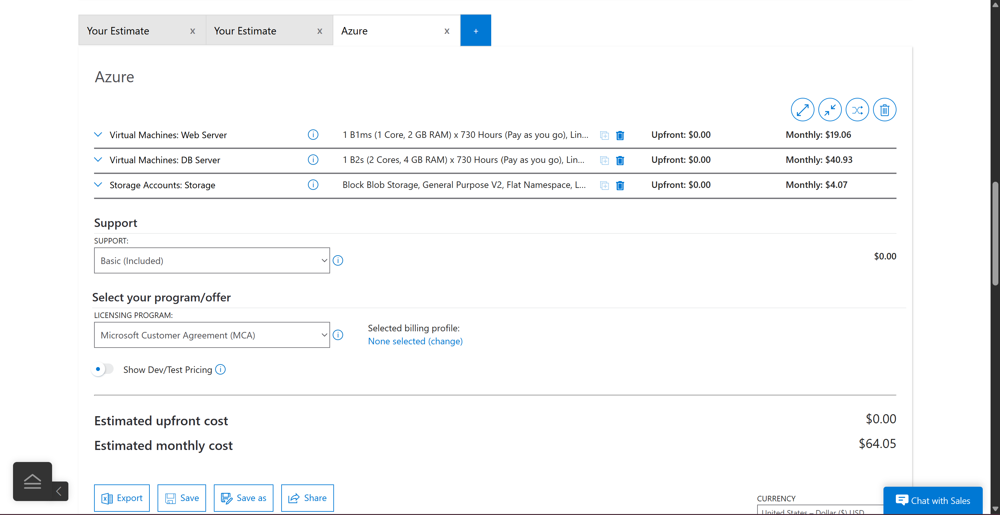
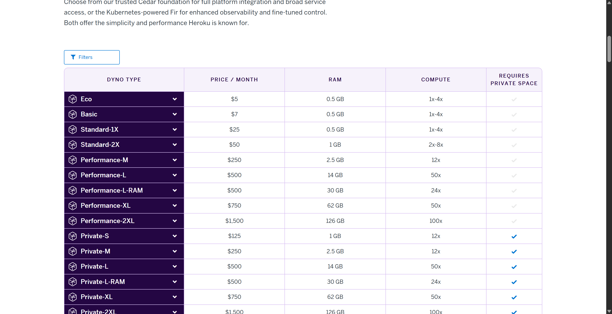
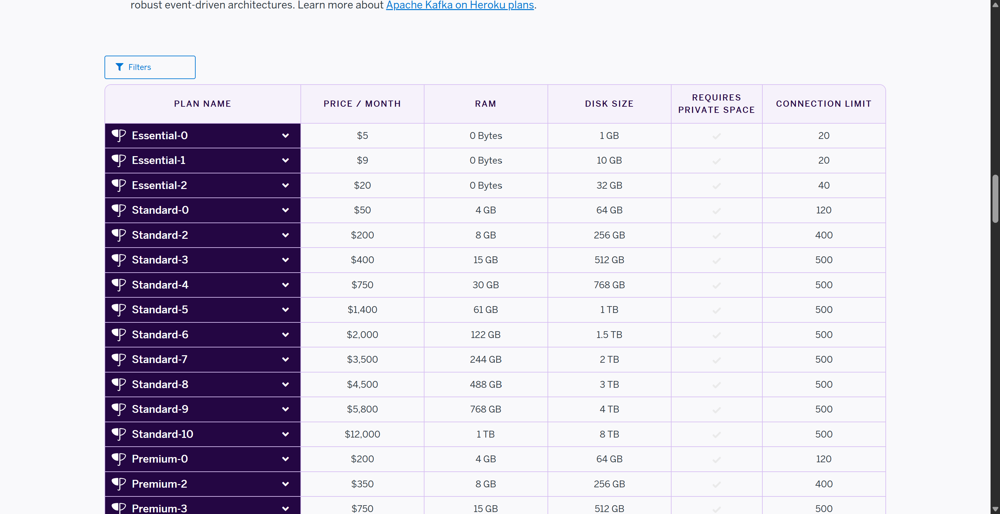
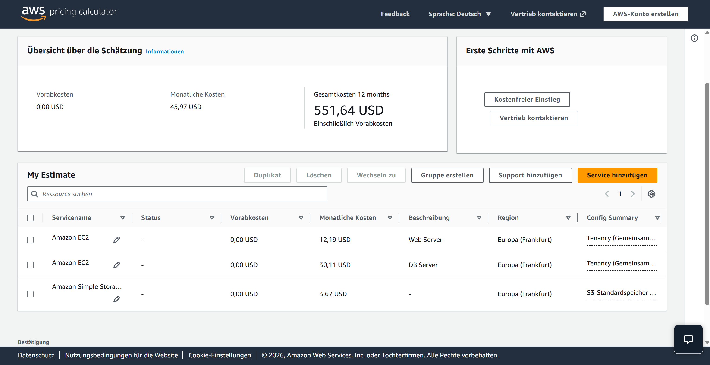

# KN10: Kostenberechnung - Cloud Migration

## Ausgangssituation

Die Firma betreibt eine eigene CRM-Software On-Premise mit folgender Spezifikation:

| Komponente | CPU | RAM | Speicher | OS |
|------------|-----|-----|----------|-----|
| Web Server | 1 Core | 2 GB | 20 GB | Ubuntu |
| DB Server | 2 Cores | 4 GB | 100 GB | Ubuntu |
| Backup-Speicher | - | - | ~150 GB | - |
| Benutzer | 30 | | | |

### Backup-Strategie
- Täglich: 7 Backups
- Wöchentlich: 4 Backups
- Monatlich: 3 Backups
- **Geschätzter Backup-Speicher: ~150 GB**

---

## A) IAAS - Rehosting: AWS & Azure (60%)

### AWS Konfiguration

#### Web Server
| Parameter | Wert | Begründung |
|-----------|------|------------|
| Instance Type | t3.small | 2 vCPU, 2 GB RAM - passt zur Anforderung (1 Core, 2 GB) |
| Storage | 20 GB gp3 | General Purpose SSD, entspricht On-Premise |
| Region | Europa (Frankfurt) | Schweizer Firma, EU-Datenschutz |
| OS | Linux (Ubuntu) | Wie On-Premise |

#### DB Server
| Parameter | Wert | Begründung |
|-----------|------|------------|
| Instance Type | t3.medium | 2 vCPU, 4 GB RAM - passt exakt zur Anforderung |
| Storage | 100 GB gp3 | Entspricht On-Premise Spezifikation |
| Region | Europa (Frankfurt) | Gleiche Region wie Web Server |
| OS | Linux (Ubuntu) | Wie On-Premise |

#### Backup Storage
| Parameter | Wert | Begründung |
|-----------|------|------------|
| Service | S3 Standard | Kostengünstig für Backup-Daten |
| Kapazität | 150 GB | Für alle Backup-Zyklen |

#### AWS Screenshot


#### AWS Gesamtkosten
| Komponente | Monatliche Kosten |
|------------|-------------------|
| Web Server (EC2 t3.small) | $12.19 |
| DB Server (EC2 t3.medium) | $30.11 |
| Backup (S3 150 GB) | $3.67 |
| **TOTAL AWS** | **$45.97/Monat** |

---

### Azure Konfiguration

#### Web Server
| Parameter | Wert | Begründung |
|-----------|------|------------|
| Instance Type | B1ms | 1 vCPU, 2 GB RAM - passt zur Anforderung |
| Storage | 32 GB Standard SSD | Kleinste Option über 20 GB |
| Region | West Europe | EU-Region für Datenschutz |
| OS | Linux (Ubuntu) | Wie On-Premise |

#### DB Server
| Parameter | Wert | Begründung |
|-----------|------|------------|
| Instance Type | B2s | 2 vCPU, 4 GB RAM - passt exakt |
| Storage | 128 GB Standard SSD | Nächste Option über 100 GB |
| Region | West Europe | Gleiche Region wie Web Server |
| OS | Linux (Ubuntu) | Wie On-Premise |

#### Backup Storage
| Parameter | Wert | Begründung |
|-----------|------|------------|
| Service | Blob Storage (Hot) | Standard für häufig abgerufene Backups |
| Kapazität | 150 GB | Für alle Backup-Zyklen |

#### Azure Screenshot


#### Azure Gesamtkosten
| Komponente | Monatliche Kosten |
|------------|-------------------|
| Web Server (B1ms + 32 GB) | $19.06 |
| DB Server (B2s + 128 GB) | $40.93 |
| Backup (Blob 150 GB) | $4.07 |
| **TOTAL Azure** | **$64.05/Monat** |

---

### Erklärung der Abweichungen (IAAS)

1. **Instance Types**: Cloud-Anbieter bieten fixe Konfigurationen. Man kann nicht exakt 1 Core/2 GB wählen, sondern muss die nächstpassende Option nehmen.

2. **Storage-Grössen**: Azure bietet nur vordefinierte Disk-Grössen (32 GB, 128 GB). AWS erlaubt granulare Auswahl.

3. **Burstable Instances**: Beide Anbieter empfehlen "Burstable" Instances (t3 bei AWS, B-series bei Azure) für Workloads mit variablem CPU-Bedarf - ideal für CRM-Anwendungen.

4. **Preisunterschied AWS vs Azure**: AWS ist günstiger ($45.97 vs $64.05) wegen kleinerer Instance-Typen und granularer Storage-Auswahl.

---

## B) PAAS - Replatforming: Heroku (20%)

### Dyno (Web Server)

#### Screenshot Heroku Dynos


| Dyno Type | Preis/Monat | RAM | Begründung |
|-----------|-------------|-----|------------|
| **Standard-2X** | **$50** | 1 GB | Production-ready, nächste Option zu 2 GB RAM |

**Hinweis**: Heroku Dynos haben weniger RAM als traditionelle Server. Standard-2X ist die minimale Production-Empfehlung für 30 User.

### Datenbank (Heroku Postgres)

#### Screenshot Heroku Postgres


| Plan | Preis/Monat | RAM | Disk | Begründung |
|------|-------------|-----|------|------------|
| **Standard-0** | **$50** | 4 GB | 64 GB | 4 GB RAM passt, 64 GB Storage reicht für Start |

**Alternative**: Standard-2 ($200/Monat) mit 256 GB Storage falls mehr Platz benötigt.

### Backup

| Parameter | Wert | Begründung |
|-----------|------|------------|
| Service | **Inkludiert** | Standard-Pläne haben automatische Backups |
| Häufigkeit | Täglich | Automatisch durch Heroku |
| Retention | 7 Tage | Standard bei Standard-Plänen |
| Kosten | **$0** | Im Postgres-Plan enthalten |

**Wichtig**: Bei Heroku Postgres Standard-Plänen sind Backups bereits inkludiert - im Gegensatz zu AWS/Azure, wo Backup-Storage separat bezahlt werden muss.

### Heroku Gesamtkosten
| Komponente | Monatliche Kosten |
|------------|-------------------|
| Web Dyno (Standard-2X) | $50 |
| Postgres (Standard-0) | $50 |
| Backup | $0 (inkludiert) |
| **TOTAL Heroku** | **$100/Monat** |

### Erklärung der Abweichungen (PAAS)

1. **Dyno vs. Server**: Heroku Dynos sind Container, keine vollständigen Server. Weniger RAM, aber optimiert für Web-Anwendungen.

2. **Managed Database**: Heroku Postgres ist vollständig verwaltet - Updates, Patches, Backups inkludiert.

3. **Kein separates OS-Management**: Ubuntu-Administration entfällt komplett.

4. **Backup inkludiert**: Im Gegensatz zu IAAS (AWS/Azure) sind bei Heroku Postgres Standard-Plänen automatische tägliche Backups bereits im Preis enthalten. Kein separater Backup-Storage nötig.

5. **Höhere Kosten, weniger Aufwand**: PAAS kostet mehr als IAAS ($100 vs. $46-64), aber eliminiert Server-Administration.

---

## C) SAAS - Repurchasing: Zoho & Salesforce (10%)

### Zoho CRM

#### Screenshot Zoho Pricing


| Plan | Preis/User/Monat | Für 30 User | Features |
|------|------------------|-------------|----------|
| Standard | €14 | €420/Monat | Basis CRM |
| **Professional** | **€23** | **€690/Monat** | Workflows, Blueprint, Inventory ✅ |
| Enterprise | €40 | €1,200/Monat | AI, Territory Management |

**Empfehlung: Professional (€23/User)**
- Enthält Workflow Automation und Blueprint für Prozessmanagement
- Gutes Preis-Leistungs-Verhältnis für 30 User
- Inventory Management für CRM-Erweiterung

---

### Salesforce Sales Cloud

#### Screenshot Salesforce Pricing


| Plan | Preis/User/Monat | Für 30 User | Features |
|------|------------------|-------------|----------|
| Free Suite | $0 | - | Max 2 User! |
| **Starter Suite** | **$25** | **$750/Monat** | Lead Management, Reports ✅ |
| Pro Suite | $100 | $3,000/Monat | Mehr Automation, Forecasting |

**Empfehlung: Starter Suite ($25/User)**
- Günstigste Option für 30 User
- Enthält alle CRM-Basics
- Pro Suite wäre zu teuer für die Anforderungen

---

### SAAS-Vergleich und Auswahl

| Anbieter | Plan | Kosten/Monat (30 User) | Empfehlung |
|----------|------|------------------------|------------|
| **Zoho CRM** | Professional | **€690 (~$750)** | ✅ **Beste Wahl** |
| Salesforce | Starter Suite | $750 | Gute Alternative |

**Begründung für Zoho:**
1. Mehr Features im Professional-Plan als Salesforce Starter
2. Einfachere Benutzeroberfläche
3. Geringere Implementierungskosten
4. Weniger komplex für KMU

---

## D) Interpretation der Resultate (10%)

### Kostenvergleich aller Varianten

| Variante | Modell | Monatliche Kosten | Jährliche Kosten |
|----------|--------|-------------------|------------------|
| AWS | IAAS | $45.97 | $551.64 |
| Azure | IAAS | $64.05 | $768.60 |
| Heroku | PAAS | $100.00 | $1,200.00 |
| Zoho CRM | SAAS | ~$750.00 | ~$9,000.00 |
| Salesforce | SAAS | $750.00 | $9,000.00 |

### Versteckte Kosten (nicht in Kalkulatoren)

#### IAAS (AWS/Azure)
- **Personal**: IT-Admin für Server-Management (grösster Faktor!)
- **Netzwerk-Traffic**: Egress-Kosten bei hohem Traffic
- **Monitoring/Logging**: CloudWatch, Azure Monitor
- **Load Balancer**: Falls Hochverfügbarkeit gewünscht

#### PAAS (Heroku)
- **Add-ons**: Logging, Monitoring, SSL
- **Skalierung**: Mehr Dynos bei Lastspitzen
- **Developer**: Anpassung der CRM-Software an Heroku

#### SAAS (Zoho/Salesforce)
- **Schulung**: Mitarbeiter müssen umlernen
- **Datenmigration**: Export/Import aus altem CRM
- **Customization**: Anpassungen kosten extra

### Warum sind die Kosten unterschiedlich?

| Faktor | IAAS | PAAS | SAAS |
|--------|------|------|------|
| Infrastruktur-Management | Kunde | Anbieter | Anbieter |
| OS-Wartung | Kunde | Anbieter | Anbieter |
| Anwendungs-Updates | Kunde | Kunde | Anbieter |
| Sicherheits-Patches | Kunde | Anbieter | Anbieter |
| Backup-Management | Kunde | Teil-Anbieter | Anbieter |
| Support | Basis | Erweitert | Umfassend |

**Je mehr der Anbieter übernimmt, desto teurer wird es - aber desto weniger Arbeit hat die Firma.**

### Sind die Unterschiede gerechtfertigt?

**Ja**, weil:
1. **IAAS** ($46-64/Monat) ist günstig, aber die Firma braucht IT-Personal (Gehalt: $5,000-10,000/Monat!)
2. **PAAS** ($100/Monat) reduziert Admin-Aufwand erheblich
3. **SAAS** ($750/Monat) eliminiert alle technischen Sorgen komplett

**Die "billigste" Option (AWS) wird teuer, wenn man IT-Personalkosten einrechnet.**

---

### Aufwand für die Firma

#### IAAS (AWS/Azure) - Rehosting
| Aufgabe | Einmalig | Laufend/Monat |
|---------|----------|---------------|
| Server einrichten | 4h | - |
| CRM installieren | 8h | - |
| Daten migrieren | 8h | - |
| Netzwerk/Security | 8h | - |
| Updates, Patches, Backups | - | 4-8h |
| **Total** | **~30h** | **~6h/Monat** |

**Voraussetzung**: IT-Know-how für Linux, Netzwerk, Datenbanken

#### PAAS (Heroku) - Replatforming
| Aufgabe | Einmalig | Laufend/Monat |
|---------|----------|---------------|
| CRM für Heroku anpassen | 16h | - |
| Deployment einrichten | 4h | - |
| Datenbank migrieren | 4h | - |
| Code-Updates | - | 2-4h |
| **Total** | **~25h** | **~3h/Monat** |

**Voraussetzung**: Entwickler-Know-how

#### SAAS (Zoho/Salesforce) - Repurchasing
| Aufgabe | Einmalig | Laufend/Monat |
|---------|----------|---------------|
| Account einrichten | 2h | - |
| Daten migrieren | 8h | - |
| Customization | 16h | - |
| Mitarbeiter-Schulung | 16h | - |
| Administration | - | 1-2h |
| **Total** | **~42h** | **~1.5h/Monat** |

**Voraussetzung**: Kein IT-Know-how nötig

---

### Empfehlung für den CEO

| Szenario | Empfehlung | Begründung |
|----------|------------|------------|
| Firma hat IT-Team | **AWS** | Günstigste Option, volles Control |
| Firma hat Entwickler | **Heroku** | Guter Mittelweg |
| Firma will keine IT-Arbeit | **Zoho CRM** | Alles inkludiert |

**Für eine Firma ohne technisches Know-how empfehle ich Zoho CRM Professional:**
- Keine IT-Administration nötig
- Moderne, sichere CRM-Lösung
- Die höheren Kosten ($750/Monat vs. $46/Monat) werden durch eingesparte IT-Personalkosten mehr als kompensiert

---

## Dateien

```
KN10/
├── README.md
└── Bilder/
    ├── aws-uebersicht.png
    ├── azure-uebersicht.png
    ├── heroku-dynos.png
    ├── heroku-postgres.png
    ├── zoho-pricing.png
    └── salesforce-pricing.png
```
